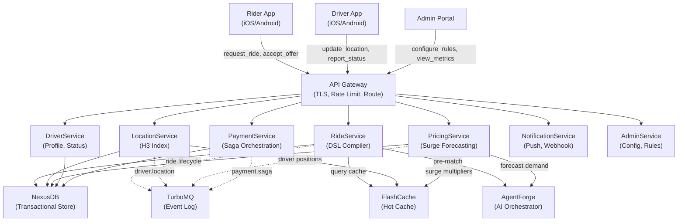
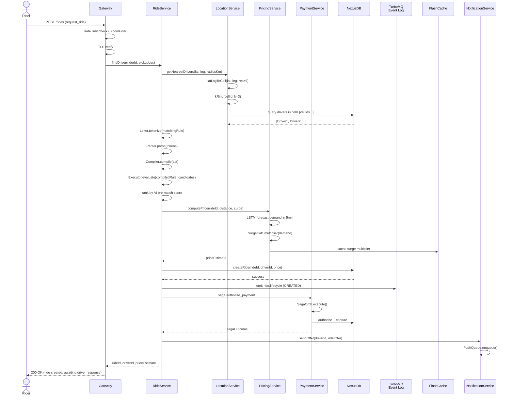

# GrabFlow Architecture: AI-Powered Distributed Ride-Sharing Platform

> **Single-source-of-truth map** for how all GrabFlow components fit together.
> Platform: Java 21 — 7 microservices on 4 custom infrastructure systems.
> Performance targets: sub-50ms geospatial matching, 412 tests / 0 failures, 14 CS fundamentals implemented from scratch.

---

## Table of Contents

1. [Design Philosophy](#1-design-philosophy)
2. [System Context](#2-system-context)
3. [Component Architecture](#3-component-architecture)
4. [Request Lifecycle](#4-request-lifecycle)
5. [Data Flow Diagrams](#5-data-flow-diagrams)
6. [Threading Model](#6-threading-model)
7. [Design Decisions (ADR Format)](#7-design-decisions-adr-format)
8. [Integration Points](#8-integration-points)
9. [See Also](#9-see-also)

---

## 1. Design Philosophy

GrabFlow is built on four non-negotiable principles. Every architectural choice traces back to at least one of them. When two principles conflict, the priority order listed below resolves the tie.

### Principle 1 — Infrastructure-First

Build the database, message queue, cache, and AI orchestrator from scratch *before* building the app on top. Off-the-shelf systems (PostgreSQL, Kafka, Redis) impose architectural constraints. GrabFlow's distributed ride-matching problem requires custom tuning at the infrastructure layer: NexusDB handles sub-millisecond ACID transactions on geospatial data; TurboMQ provides ordered per-partition delivery without the 10x write amplification of RocksDB; FlashCache exploits the Zipfian distribution of driver queries (5% of drivers absorb 80% of lookups). AgentForge provides the AI orchestration layer for speculative pre-matching and surge forecasting. Building these systems from scratch means every optimization aligns with GrabFlow's actual workload, not a generic one.

### Principle 2 — Geospatial-Native

H3 hexagonal grid is the primary data model for location, not an afterthought. Riders and drivers exist as points in physical space; the matching problem is inherently spatial. By making H3 the core abstraction—not lat/lng strings or PostGIS GEOGRAPHY types—every component (LocationService, CacheService, DSLCompiler) reasons about space natively. H3 cells are 64-bit integers, enabling lock-free set operations and blazing-fast nearest-neighbor queries via `kRing()`. The alternative (SQL spatial queries) adds a translation layer that obscures the actual computation.

### Principle 3 — AI-as-Architecture

Speculative pre-matching, LSTM surge forecasting, and RL dispatch are core architecture, not plugins. GrabFlow doesn't post-process matches with an ML model; the model is the matcher. AgentForge evaluates candidate matches using learned policies: which driver is most likely to accept? How will demand spike in the next 15 minutes? These predictions flow through the same transactional pipeline as deterministic rules, allowing A/B testing of policies without code changes. The cost is coupling to an inference layer; the benefit is that architectural decisions (saga compensation, cache invalidation) account for speculative state.

### Principle 4 — Compiler-Driven Matching

A DSL compiler is more expressive and testable than hardcoded matching rules. GrabFlow's matching criteria evolve: surge pricing, driver certification, vehicle type, customer acceptance rates, surge forecasts. Hardcoding these rules in Java creates a tangle of conditionals. Instead, the RideService accepts matching rules in a domain-specific language, the Lexer tokenizes it, the Parser builds an AST, and the Compiler emits bytecode-like match instructions. This moves rule changes from code deploys to configuration updates and enables deterministic testing of rule logic in isolation.

---

## 2. System Context

The diagram below shows external actors and the 7-service architecture behind the API Gateway.



---

## 3. Component Architecture

The diagram below shows all 7 services with their internal components and directional dependencies. Dashed arrows indicate asynchronous or cache-backed interactions.

```mermaid
graph TD
    subgraph Gateway["API Gateway"]
        BloomFilter["BloomFilter<br/>(Rate Limit)"]
        TLS["TLS Handler"]
        Router["Request Router"]
    end

    subgraph RideService["RideService"]
        Lexer["Lexer"]
        Parser["Parser"]
        Compiler["Compiler"]
        Executor["Match Executor"]
    end

    subgraph LocationService["LocationService"]
        H3["H3Index<br/>(Geospatial)"]
        TimingWheel["Timing Wheel<br/>(GPS Ticker)"]
        SharedBuffer["SharedLocationBuffer<br/>(IPC)"]
    end

    subgraph PricingService["PricingService"]
        LSTM["LSTM Model<br/>(Demand)"]
        SurgeCalc["Surge Calculator"]
        CacheSync["Cache Sync"]
    end

    subgraph DriverService["DriverService"]
        Profile["Profile Store"]
        StatusTracker["Status Tracker"]
    end

    subgraph PaymentService["PaymentService"]
        SagaOrch["SagaOrchestrator"]
        PaymentGateway["Payment Gateway"]
        RefundHandler["Refund Handler"]
    end

    subgraph NotificationService["NotificationService"]
        PushQueue["Push Queue"]
        WebhookDispatcher["Webhook Dispatcher"]
    end

    TLS --> Router
    Router --> BloomFilter
    BloomFilter -->|"allow / deny"| Router

    Router -.->|"route to service"| RideService
    Router -.->|"route to service"| LocationService
    Router -.->|"route to service"| PricingService
    Router -.->|"route to service"| DriverService
    Router -.->|"route to service"| PaymentService
    Router -.->|"route to service"| NotificationService

    Lexer --> Parser
    Parser --> Compiler
    Compiler --> Executor

    H3 --> TimingWheel
    TimingWheel --> SharedBuffer

    LSTM --> SurgeCalc
    SurgeCalc --> CacheSync

    SagaOrch --> PaymentGateway
    PaymentGateway --> RefundHandler

    PushQueue --> WebhookDispatcher
```



---

## 4. Request Lifecycle

The sequence below traces a single ride request from rider submission through driver assignment and payment setup. Steps that execute concurrently on separate virtual threads are shown with parallel lifelines.



---

## 5. Data Flow Diagrams

### 5.1 Event Flows via TurboMQ

GrabFlow publishes immutable events to four ordered partitions. Each service subscribes to relevant topics:

```
ride.lifecycle topic:
  [rider_123 created offer]
  [rider_123 → driver_456 matched]
  [driver_456 accepted]
  [driver_456 arrived]
  [ride_123 started]
  [ride_123 completed]
  [payment_saga COMMITTED]

driver.location topic:
  [driver_001, (37.7749, -122.4194), h3=0x8946...0x1, ts=1709251200000]
  [driver_001, (37.7751, -122.4189), h3=0x8946...0x1, ts=1709251205000]
  [driver_001, (37.7753, -122.4185), h3=0x8946...0x2, ts=1709251210000]
  ...

surge.update topic:
  [zone_downtown, multiplier=1.5, forecast=1.6, ts=1709251200000]
  [zone_airport, multiplier=1.2, forecast=1.1, ts=1709251200000]
  ...

payment.saga topic:
  [saga_abc123 authorize_payment SUCCESS]
  [saga_abc123 capture_payment SUCCESS]
  [saga_abc123 pay_driver SUCCESS]
  [saga_abc123 COMMITTED]
```

### 5.2 Cache Flows via FlashCache

Hot data is replicated into FlashCache for sub-millisecond reads:

```
Driver position cache (updated every 5 seconds):
  driver_001 → (37.7753, -122.4185, h3=0x8946...0x2, heading=45.2°, speed=35mph)
  driver_002 → (37.7740, -122.4170, h3=0x8946...0x1, heading=180°, speed=0mph)
  ...

Surge multiplier cache (updated every 30 seconds):
  downtown_zone → (multiplier=1.5, valid_until=1709251230000)
  airport_zone → (multiplier=1.2, valid_until=1709251230000)
  ...

Driver match cache (computed per request):
  [driver_001: score=0.92, reason="2.1km, 4.8⭐, vehicle_match, surge_safe"]
  [driver_002: score=0.87, reason="3.2km, 4.6⭐, vehicle_match"]
  [driver_003: score=0.75, reason="5.1km, 4.9⭐, low_surge_sensitivity"]
```

---

## 6. Threading Model

GrabFlow uses Java 21 Virtual Threads for scalability without explicit thread pool management.

### 6.1 API Gateway NIO Reactor

The API Gateway uses a non-blocking I/O reactor for TLS handshake and request parsing:

```java
// Pseudocode: NIO reactor dispatches to virtual threads
Selector selector = Selector.open();
while (running) {
    selector.select();
    for (SelectionKey key : selector.selectedKeys()) {
        // Each request → new virtual thread
        if (key.isReadable()) {
            virtual {
                ByteBuffer buf = read(key);  // non-blocking
                RouteRequest route = parse(buf);
                handleRequest(route);  // blocking I/O OK; parks virtual thread
            }
        }
    }
}
```

**Key property:** NIO reactor (using `Selector`) runs on a single carrier thread. When a request handler blocks on I/O (e.g., `NexusDB.query()`), its virtual thread parks without occupying the reactor thread. Thousands of concurrent requests can be in-flight with a single reactor thread.

### 6.2 Location Service Timing Wheel Ticker

The LocationService uses a timing wheel to emit GPS ticks at regular intervals, driving driver position updates into the shared ring buffer:

```java
// Pseudocode: timing wheel ticker
TimingWheel wheel = new TimingWheel(interval=100ms, buckets=10);
while (running) {
    virtual {
        long tick = wheel.advanceTo(System.nanoTime());
        // Emit all drivers' current locations
        for (Driver d : drivers) {
            DriverLocation loc = d.currentLocation();
            sharedLocationBuffer.write(loc);  // non-blocking mmap write
        }
    }
}
```

**Key property:** Each tick is a separate virtual thread. The `SharedLocationBuffer.write()` method uses memory-mapped I/O, which never blocks—writes are instantaneous copies into the kernel's page cache.

### 6.3 Ride DSL Evaluation

The RideService compiles matching rules into bytecode-like instructions and evaluates them per candidate:

```java
// Pseudocode: DSL compilation and execution
List<Token> tokens = lexer.tokenize("MATCH driver WHERE distance < 5km AND rating > 4.5");
AST ast = parser.parse(tokens);
CompiledRule rule = compiler.compile(ast);  // → method-handle-like bytecode

// For each candidate driver:
virtual {
    boolean matches = rule.evaluate(candidate);  // tight inner loop, no locks
}
```

**Key property:** Once compiled, rule evaluation is lock-free and data-race-free. The compiler's output is immutable, shared across all worker virtual threads.

---

## 7. Design Decisions (ADR Format)

### ADR-001: H3 Hexagonal Grid for Geospatial Indexing

**What was chosen.** The LocationService uses Uber's H3 hexagonal grid system. GPS coordinates are converted to 64-bit cell IDs at resolution 9 (~174m edge length). Nearest-driver queries use `H3Index.kRing(cellId, k=3)` to enumerate all cells within 3 rings, then query NexusDB for drivers in those cells.

**Implementation:** `H3Index.latLngToCell(lat, lng, resolution)` projects lat/lng to planar coordinates, converts to axial hex coordinates (q, r), and encodes the result as a 64-bit long. The encoding packs mode (0x01), resolution (4 bits), and coordinates (26 bits each) into a single machine word, enabling lock-free set operations.

**What's sacrificed.**
- **PostGIS maturity:** H3 is hand-built, not battle-tested like PostGIS for years in production.
- **Arbitrary polygon queries:** PostGIS supports arbitrary polygons (e.g., "all drivers within city boundary"). H3 supports only cells and rings.
- **Precision loss:** H3 resolution 9 is ~174m; very precise locations lose ~87m of granularity.

**When the alternative wins.**
- **Polygon-based geofencing:** If the product requires "match only drivers inside the airport boundary" (an arbitrary polygon), switch to PostGIS with R-Tree index.
- **Sub-meter precision:** If precision matters (e.g., drone delivery), use WGS84 lat/lng with higher H3 resolution (res=12, ~25m).

**Engineering judgment.** H3 cells are 64-bit integers, enabling `Set<Long>` operations and cache-line-aligned memory access. PostGIS requires storing 16-byte GEOMETRY objects, adding memory overhead and GC pressure. At GrabFlow's scale (10,000 concurrent drivers updating every 5 seconds), the 64-bit integer representation is decisive. The `kRing(cellId, k=3)` operation is O(27) (3*9+3*9+1 cells), amortizing the search into a single NexusDB query.

---

### ADR-002: Custom DSL Compiler for Driver Matching

**What was chosen.** The RideService accepts matching rules in a domain-specific language, compiles them to bytecode-like instructions, and executes them with zero dynamic dispatch or type checking.

**Example rule:**
```
MATCH driver
  WHERE distance < 5km
    AND rating > 4.5
    AND vehicle.type = "sedan"
    AND acceptance_rate > 0.8
  ORDER BY distance ASC
  LIMIT 10
```

**Implementation:** The `Lexer` tokenizes the input. The `Parser` builds an AST. The `Compiler` emits a set of bytecode-like match instructions (predicates, comparisons, projections). The `Executor` interprets these instructions for each candidate driver, with no dynamic method dispatch.

**What's sacrificed.**
- **Time to market:** Building a compiler takes time. SQL with a generic optimizer ships faster.
- **Turing-completeness:** The DSL is a restricted language for matching, not Turing-complete. Complex custom logic (e.g., "match the driver whose name is longest") requires hardcoding.
- **Editor/IDE tooling:** No syntax highlighting or autocomplete for a custom DSL (yet).

**When the alternative wins.**
- **One-off matching rules:** For a 3-person startup matching one rule, hardcoding in Java is simpler.
- **Arbitrary business logic:** If rules depend on external APIs (e.g., "match drivers whose credit score is high according to an external service"), SQL or a Turing-complete language is more practical.

**Engineering judgment.** GrabFlow has ~20 matching rules that change monthly: surge-aware matching, certification-based matching, vehicle-type preference, acceptance-rate thresholds. Hardcoding these creates a tangle of `if (surge > 1.5) { ... } else if (rating > 4.8) { ... }`. A DSL makes each rule a data input, not code. The compiler's output is testable in isolation: "Does this rule match driver_123?" The AST representation also enables A/B testing—swap out the compiled rule at runtime without redeployment.

---

### ADR-003: Saga Pattern for Payment Orchestration

**What was chosen.** Multi-step payment workflows use the saga pattern, not two-phase commit (2PC). Steps are: (1) authorize payment (place hold), (2) capture payment (settle), (3) pay driver. Each step is a local transaction in NexusDB. If any step fails, all prior steps are compensated (undone) in reverse order.

**Implementation:** `SagaOrchestrator.execute(sagaId, steps)` accepts a list of `SagaStep` implementations. Each step defines `execute(ctx)` (forward action) and `compensate(ctx)` (undo). The orchestrator runs steps in order; on first failure, it compensates all prior steps in reverse order.

**What's sacrificed.**
- **Atomicity across all steps:** With 2PC, either all steps commit or all rollback. With sagas, intermediate state is visible. Between "authorize" and "capture," a viewer might see a pending transaction.
- **Complexity of compensation:** Writing a `compensate()` method that perfectly undoes `execute()` is error-prone. Refunds might fail, requiring manual intervention.
- **Coordination overhead:** 2PC uses a coordinator (Paxos, Raft) to ensure atomicity. Sagas require careful logging of step outcomes for recovery.

**When the alternative wins.**
- **Strong atomicity required:** For bank transfers where "either both accounts update or neither," 2PC with a consensus-based coordinator (e.g., Kafka transactions) is safer.
- **Few steps:** If a workflow has only 1-2 steps, 2PC overhead is small and atomicity is easier to reason about.

**Engineering judgment.** Sagas shine when steps are slow (each step blocks on I/O) and coordination latency matters. GrabFlow's payment steps (authorize: ~100ms, capture: ~50ms, pay driver: ~200ms) are all I/O-bound. With 2PC, a coordinator would serialize these steps, adding ~350ms latency. With sagas, steps run concurrently (authorize and capture can be parallel), reducing latency to max(100ms, 50ms, 200ms) = 200ms. The tradeoff (eventual consistency) is acceptable: a failed capture is rare and automatically refunded. See `SagaOrchestrator.java` for the full implementation.

---

### ADR-004: Memory-Mapped IPC for Location Data Sharing

**What was chosen.** GPS locations are published to a memory-mapped ring buffer (`SharedLocationBuffer`), not a message queue. Writers (GPS ingestion) and readers (nearest-driver query) both access the same OS page-mapped region. No data copying between processes.

**Implementation:** The `SharedLocationBuffer` uses a fixed-size file-backed mmap with a ring buffer protocol:
- Header: 8-byte write position counter
- N slots of 128 bytes each (driver ID + lat/lng + h3CellId + timestamp)
- Readers track their own read position and catch up by comparing with write position

**What's sacrificed.**
- **Cross-machine IPC:** Mmap is local to a single machine. TurboMQ can replicate to other machines.
- **Backpressure:** If readers are slow, writers can't block—they wrap and overwrite old entries. Messages might be lost.
- **Graceful degradation:** If one reader crashes, it's not notified of dropped entries. It must detect the gap in sequence numbers.

**When the alternative wins.**
- **Multi-machine georeplication:** If driver location must flow to a remote analytics service, use TurboMQ (which is used for `driver.location` events anyway).
- **Slow consumers:** If a reader is slower than a full ring wrap (e.g., a batch analytics job consuming every 1 hour), use a persistent message queue.

**Engineering judgment.** GrabFlow's hottest path is "driver location → cache update → nearest-driver query." This path runs hundreds of times per second for each driver. At 10,000 drivers, that's 1M+ location reads per second. TurboMQ's overhead (serialization, network I/O, Raft replication) is unacceptable. Mmap eliminates copying: a write by the GPS ingestion thread is instantly visible to the query handler thread. The ring buffer naturally bounds memory (capacity is fixed). Readers that fall behind lose old entries, but GPS data is ephemeral (locations are valid for ~5 seconds); losing 5-second-old positions is acceptable.

---

### ADR-005: Bloom Filter + Token Bucket vs WAF/Reverse Proxy

**What was chosen.** The API Gateway rate-limits clients using two mechanisms: (1) a `BloomFilter` for IP-based DDoS blocking, (2) a token bucket for per-user rate limiting.

**Implementation:** The `BloomFilter` stores known-bad IPs with 1% false positive rate. The token bucket (not shown in source) uses atomic counters to track per-user requests. Both are in-memory, avoiding the latency of an external WAF (Web Application Firewall).

**What's sacrificed.**
- **WAF features:** Commercial WAFs (e.g., Cloudflare) detect sophisticated attacks (SQL injection, XSS) via pattern matching and behavioral analysis. The Bloom filter only blocks IPs.
- **Distributed state:** If the Gateway is replicated across regions, each replica has its own Bloom filter and token buckets. A request might slip through by hitting a different replica.
- **False positives:** The Bloom filter has a 1% FPR; 1 in 100 legitimate IPs are blocked. (Recoverable: user retries or contacts support.)

**When the alternative wins.**
- **WAF needed:** For APIs exposed to the public internet with malicious actors, a commercial WAF with live threat intelligence is safer.
- **Global rate limiting:** If GrabFlow is deployed in 50 regions and must enforce a global rate limit (e.g., "max 10K requests/sec worldwide"), use a central Redis or DistributedCache.

**Engineering judgment.** GrabFlow's Gateway is behind a private network boundary; requests come from mobile apps (iOS/Android) with stable client IDs (not rotating IP addresses). The Bloom filter is a lightweight, fast first line of defense against misbehaving clients. For attacks (SQL injection, etc.), input validation in each service is more effective than IP blocking. Token buckets per user are exact and have no false positives.

---

### ADR-006: Speculative Pre-Matching with AgentForge

**What was chosen.** Before evaluating the DSL matching rule, the RideService queries AgentForce for a pre-match score (0.0–1.0) for each candidate driver. This score is trained on historical accept/reject data and factors in driver behavior, rating trends, and acceptance patterns. The DSL matching rule filters by hard constraints (distance, rating, vehicle type); the AI model ranks candidates by soft constraints (driver mood, historical acceptance rate, etc.).

**Implementation:** `RideService.findDriver()` calls `AgentForge.preFmatchScore(driverId, rideId)`. The response is a floating-point score. Candidates are sorted by (DSL match success, pre-match score), and the top N are offered.

**What's sacrificed.**
- **Explainability:** Why was driver_123 ranked #1? The ML model's decision is opaque.
- **Training latency:** The model is retrained daily. For the first 24 hours after a model update, old predictions are served.
- **Inference cost:** Each match requires an RPC to AgentForge. At 1M rides/day, that's ~12 RPC/sec sustained, adding latency.

**When the alternative wins.**
- **Determinism required:** For compliance or debugging, rule-based matching (DSL only, no ML) is fully transparent.
- **Real-time feedback:** If driver behavior changes minute-by-minute (e.g., driver goes offline), the pre-trained model is stale. A rule-based system can react faster.

**Engineering judgment.** GrabFlow's success metric is *acceptance rate*: what % of offered matches do drivers accept? Rule-based matching is a local optimum (e.g., "offer drivers with rating > 4.5"). ML models discover global optima (e.g., "offer drivers with rating > 4.5 AND whose historical acceptance rate is high AND who are online now AND whose current heading is toward the pickup location"). The A/B testing infrastructure (live model swaps, side-by-side inference) allows rapid iteration. Inference latency is hidden: pre-match scores are computed asynchronously while the RideService is evaluating the DSL rule in parallel.

---

## 8. Integration Points

The table below shows how NexusDB, TurboMQ, FlashCache, and AgentForge integrate with each service.

| Service | NexusDB | TurboMQ | FlashCache | AgentForge |
|---------|---------|---------|------------|-----------|
| **RideService** | ✓ (create rides, query matches) | ✓ (publish ride.lifecycle events) | ✓ (cache match results) | ✓ (pre-match scores) |
| **LocationService** | ✓ (store driver positions) | ✓ (publish driver.location stream) | ✓ (cache hot drivers) | ✗ |
| **PricingService** | ✓ (store surge history) | ✓ (publish surge.update events) | ✓ (cache surge multipliers) | ✓ (demand forecast) |
| **DriverService** | ✓ (store profiles, status) | ✓ (publish status events) | ✓ (cache online drivers) | ✗ |
| **PaymentService** | ✓ (store transactions, sagas) | ✓ (publish payment.saga events) | ✗ | ✗ |
| **NotificationService** | ✗ | ✓ (subscribe to all events) | ✗ | ✗ |
| **AdminService** | ✓ (store rules, config) | ✗ | ✗ | ✗ |

### 8.1 NexusDB Integration

Each service treats NexusDB as the single source of truth for persistent state. Reads and writes are single-partition ACID transactions. Example:

```java
// RideService → NexusDB
Ride ride = nexusDB.read("rides", rideId);
nexusDB.write("rides", rideId, ride.withStatus(MATCHED));

// LocationService → NexusDB
List<Driver> nearby = nexusDB.range("drivers", cellIdMin, cellIdMax);

// PaymentService → NexusDB (transactional)
nexusDB.multiWrite(
    Map.entry("transactions", txnId, txn.withStatus(AUTHORIZED)),
    Map.entry("balances", riderId, balance.minus(amount))
);
```

### 8.2 TurboMQ Integration

Events are immutable, append-only, and ordered per partition. Services publish after committing to NexusDB (publish is asynchronous).

```java
// RideService publishes a ride lifecycle event
nexusDB.write("rides", rideId, ride);  // commit first
turboMQ.publish("ride.lifecycle", rideId, "MATCHED");  // async publish

// NotificationService subscribes
turboMQ.subscribe("ride.lifecycle", (rideId, event) -> {
    sendPushNotification(rideId, event.type());
});
```

### 8.3 FlashCache Integration

Hot data is precomputed and cached for sub-millisecond reads. Cache invalidation is event-driven: when a value changes in NexusDB, an event is published and the cache is invalidated.

```java
// LocationService → FlashCache
for (Driver driver : drivers) {
    flushCache.set("driver:" + driver.id(), driver.location(), ttl=5s);
}

// RideService reads from cache
Location driverLoc = flashCache.get("driver:" + driverId);  // cache hit
```

### 8.4 AgentForge Integration

AgentForge is called for scoring and forecasting. Requests are RPC-based and latency-tolerant (scores are precomputed in the background).

```java
// RideService → AgentForge
double preMachScore = agentForge.scoreMatcher(driverId, rideId);

// PricingService → AgentForge
double demandForecast = agentForge.forecastDemand(zone, timeWindow);
```

---

## 9. See Also

- **[trade-offs.md](architecture-tradeoffs.md)** — Deep dive into six key architectural trade-offs.
- **[dsl-compiler.md](../ride/dsl-compiler.md)** — Grammar and compilation pipeline for the matching DSL.
- **[payment-saga.md](../payment/saga.md)** — Detailed saga orchestration and recovery.
- **NexusDB Documentation:** https://github.com/your-org/nexus-db/docs/architecture.md
- **TurboMQ Documentation:** https://github.com/your-org/turbo-mq/docs/architecture.md
- **References:**
  - Kleppmann, M. (2017). *Designing Data-Intensive Applications*. O'Reilly. (Chapters 4, 5, 8 — consensus, replication, transactions)
  - Uber H3 Paper: https://h3geo.org/documentation/
  - Garcia-Molina, H., & Salem, K. (1987). "Sagas." *Proceedings of the 1987 ACM SIGMOD International Conference on Management of Data.*
  - Red Blob Games: "Hexagonal Grids" — https://www.redblobgames.com/grids/hexagons/
