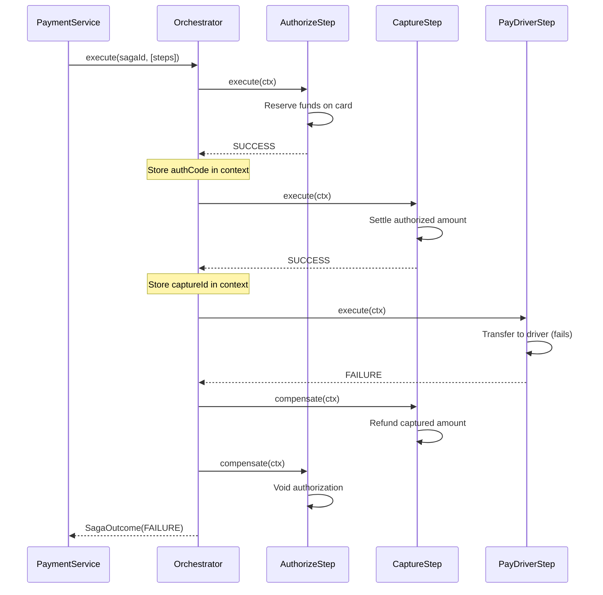
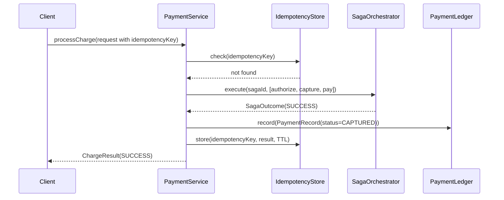

# GrabFlow — Payment Orchestration: Saga-Based Distributed Transactions

> **Deep dive** into payment processing with compensating transactions.
> CS Fundamental: Saga pattern (Garcia-Molina & Salem, 1987), idempotency, distributed state.
> Guarantees: exactly-once payment processing via idempotency keys, automatic compensation on failure.

---

## Table of Contents

1. [Saga Pattern Overview](#1-saga-pattern-overview)
2. [Payment Saga Steps](#2-payment-saga-steps)
3. [Saga Orchestrator](#3-saga-orchestrator)
4. [Idempotency Store](#4-idempotency-store)
5. [Payment Ledger](#5-payment-ledger)
6. [PaymentService Integration](#6-paymentservice-integration)
7. [Fraud Detection Integration](#7-fraud-detection-integration)
8. [See Also](#8-see-also)

---

## 1. Saga Pattern Overview

### What Is a Saga?

A **saga** is a design pattern for managing long-lived transactions across multiple distributed services without using two-phase locking (2PC). Instead of locking resources globally, a saga breaks a transaction into a sequence of local transactions, each paired with a **compensating action** that undoes the transaction's effects if a later step fails.

### Why Not Two-Phase Locking?

Two-phase locking (2PC) is the traditional way to coordinate distributed transactions:

1. **Prepare phase** — All services lock their resources and prepare to commit
2. **Commit phase** — All services commit simultaneously, or all rollback

Problems:
- **Deadlock risk** — Global locks on resources across services easily deadlock
- **Availability** — A single service failure blocks the entire transaction
- **Latency** — Resources are locked for the duration of the entire transaction
- **Complexity** — Requires a coordinator service and complex error recovery

Sagas avoid these issues by committing each step immediately and relying on compensations to undo work on failure.

### Compensating Transactions Concept

For every forward action, there is a corresponding compensating action:

| Forward Action | Compensating Action | Effect |
|---|---|---|
| Authorize (reserve) funds | Void authorization | Release the hold |
| Capture (settle) payment | Refund funds | Return money to buyer |
| Transfer to driver | Reverse transfer | Debit driver account |

When a step fails, all previously completed steps are compensated in **reverse order**, undoing the transaction's effects.

### GrabFlow Payment Saga Example

When a ride completes, the payment saga executes three steps in order:

```
Step 1: authorize_payment   - Reserve funds on rider's card
Step 2: capture_payment     - Settle the reserved amount
Step 3: pay_driver          - Transfer driver's share

On success: [AUTHORIZED] → [CAPTURED] → [COMPLETED]

On failure at Step 3:
  [AUTHORIZED] → [CAPTURED] → (Step 3 fails)
                     ↑
                     └─ Compensate: Refund capture
                        └─ Compensate: Void authorization
```

### Failure Scenarios

**If capture_payment fails:**
- Compensate Step 1: void the authorization
- Release the hold on rider's card

**If pay_driver fails:**
- Compensate Step 2: refund the captured amount
- Compensate Step 1: void the authorization
- Rider's money is returned; driver account is not charged

### Sequence Diagram



---

## 2. Payment Saga Steps

Each step in the GrabFlow payment saga has two responsibilities: a forward action and a compensating action.

### Step 1: AuthorizeStep

**Forward Action:** Reserve funds on the rider's payment method (credit card, debit card, or e-wallet).

```java
public SagaOrchestrator.SagaResult execute(SagaOrchestrator.SagaContext ctx) {
    String authCode = "AUTH-" + UUID.randomUUID().toString().substring(0, 8).toUpperCase();
    ctx.data().put("authCode", authCode);
    ctx.data().put("amount", request.amount());
    LoggerFactory.getLogger(AuthorizeStep.class)
            .info("Authorized {} for rider {} (authCode={})",
                  request.amount(), request.riderId(), authCode);
    return SagaOrchestrator.SagaResult.SUCCESS;
}
```

**Key Point:** The authorization code is stored in the shared `ctx.data()` map so downstream steps can reference it.

**Compensating Action:** Void the authorization, releasing the hold.

```java
public void compensate(SagaOrchestrator.SagaContext ctx) {
    String authCode = (String) ctx.data().get("authCode");
    LoggerFactory.getLogger(AuthorizeStep.class)
            .info("Voiding authorization {} for rider {}", authCode, request.riderId());
}
```

**Key Point:** The compensating action uses data stored during the forward execution. If execution fails and the context is not populated, the compensating action can handle missing data gracefully (implementation shown logs the event).

### Step 2: CaptureStep

**Forward Action:** Settle the authorized amount, moving funds from the rider's account.

```java
public SagaOrchestrator.SagaResult execute(SagaOrchestrator.SagaContext ctx) {
    String authCode = (String) ctx.data().get("authCode");
    String captureId = "CAP-" + UUID.randomUUID().toString().substring(0, 8).toUpperCase();
    ctx.data().put("captureId", captureId);
    LoggerFactory.getLogger(CaptureStep.class)
            .info("Captured {} against auth {} (captureId={})",
                  request.amount(), authCode, captureId);
    return SagaOrchestrator.SagaResult.SUCCESS;
}
```

**Key Point:** This step reads the `authCode` from `ctx.data()`, proving that Step 1 succeeded and can be compensated.

**Compensating Action:** Refund the captured amount, returning funds to the rider.

```java
public void compensate(SagaOrchestrator.SagaContext ctx) {
    String captureId = (String) ctx.data().get("captureId");
    LoggerFactory.getLogger(CaptureStep.class)
            .info("Refunding capture {} for rider {}", captureId, request.riderId());
}
```

### Step 3: PayDriverStep

**Forward Action:** Transfer the driver's share to the driver's bank account.

```java
public SagaOrchestrator.SagaResult execute(SagaOrchestrator.SagaContext ctx) {
    String transferId = "TXN-" + UUID.randomUUID().toString().substring(0, 8).toUpperCase();
    ctx.data().put("transferId", transferId);
    LoggerFactory.getLogger(PayDriverStep.class)
            .info("Paid driver {} amount {} (transferId={})",
                  request.driverId(), request.amount(), transferId);
    return SagaOrchestrator.SagaResult.SUCCESS;
}
```

**Key Point:** This is the final step. If it fails, Steps 1 and 2 are compensated in reverse order.

**Compensating Action:** Reverse the transfer, debiting the driver's account.

```java
public void compensate(SagaOrchestrator.SagaContext ctx) {
    String transferId = (String) ctx.data().get("transferId");
    LoggerFactory.getLogger(PayDriverStep.class)
            .info("Reversing driver transfer {} for driver {}", transferId, request.driverId());
}
```

### Step Contracts

Each `SagaStep` implements:

```java
public interface SagaStep {
    /**
     * Execute the forward action. Return SUCCESS to continue, FAILURE to abort.
     */
    SagaResult execute(SagaContext ctx);

    /**
     * Undo the effects of a previously successful execute().
     */
    void compensate(SagaContext ctx);

    /** Human-readable name for logging. */
    default String name() {
        return getClass().getSimpleName();
    }
}
```

---

## 3. Saga Orchestrator

The `SagaOrchestrator` is the engine that executes a saga: it runs steps forward and, on failure, compensates in reverse.

### Core Execution Loop

```java
public SagaOutcome execute(String sagaId, List<SagaStep> steps) {
    SagaContext ctx = SagaContext.of(sagaId);
    log.info("Saga [{}] starting with {} step(s)", sagaId, steps.size());

    List<SagaStep> completed = new ArrayList<>();

    for (SagaStep step : steps) {
        log.debug("Saga [{}] executing step '{}'", sagaId, step.name());
        SagaResult result;
        try {
            result = step.execute(ctx);
        } catch (Exception e) {
            log.error("Saga [{}] step '{}' threw unexpectedly: {}",
                     sagaId, step.name(), e.getMessage(), e);
            result = SagaResult.FAILURE;
        }

        if (result == SagaResult.SUCCESS) {
            completed.add(step);
            log.debug("Saga [{}] step '{}' succeeded", sagaId, step.name());
        } else {
            String reason = "Step '" + step.name() + "' failed";
            log.warn("Saga [{}] {} — compensating {} completed step(s)",
                     sagaId, reason, completed.size());
            compensateAll(sagaId, completed, ctx);
            return new SagaOutcome(sagaId, SagaResult.FAILURE, completed.size(), reason);
        }
    }

    log.info("Saga [{}] completed successfully ({} step(s))", sagaId, completed.size());
    return new SagaOutcome(sagaId, SagaResult.SUCCESS, completed.size(), null);
}
```

### Compensation in Reverse Order

```java
private void compensateAll(String sagaId, List<SagaStep> completed, SagaContext ctx) {
    for (int i = completed.size() - 1; i >= 0; i--) {
        SagaStep step = completed.get(i);
        log.debug("Saga [{}] compensating step '{}'", sagaId, step.name());
        try {
            step.compensate(ctx);
        } catch (Exception e) {
            // Compensation failures are logged but must not block other compensations.
            log.error("Saga [{}] compensation of '{}' threw: {}",
                     sagaId, step.name(), e.getMessage(), e);
        }
    }
}
```

**Key Point:** Compensation runs in reverse order of completion. If a compensation fails (throws), the exception is logged and compensation continues for the remaining steps. This ensures partial cleanup on cascading failures.

### SagaContext

A mutable context shared across all steps in a single saga execution:

```java
public record SagaContext(String sagaId, Map<String, Object> data) {
    public static SagaContext of(String sagaId) {
        return new SagaContext(sagaId, new HashMap<>());
    }
}
```

Steps communicate via `ctx.data()`:
- Step 1 writes the authorization code
- Step 2 reads it and writes the capture ID
- Step 3 reads and validates previous data

### SagaOutcome

The result of a saga execution:

```java
public record SagaOutcome(
        String sagaId,
        SagaResult result,
        int stepsCompleted,
        String failureReason
) {
    public boolean isSuccess() {
        return result == SagaResult.SUCCESS;
    }
}
```

---

## 4. Idempotency Store

The `IdempotencyStore` prevents duplicate payment processing when clients retry failed or timed-out requests.

### Why Idempotency?

In distributed systems, network failures can cause clients to retry the same request multiple times:

```
Client: "Process payment for ride-123"
        (sends request)

Server: (processes payment, charges $15, crashes before responding)

Client: (timeout, retries)
        "Process payment for ride-123"

Server: (if no idempotency check, charges $15 again = $30 total)
```

Without idempotency, the rider is charged twice. With idempotency, the same result is returned.

### Idempotency Key Pattern

The client provides a unique **idempotency key** (often a UUID or hash of the request). The server uses it to deduplicate:

```
ChargeRequest {
    rideId: "ride-123",
    riderId: "rider-456",
    driverId: "driver-789",
    amount: 15.00,
    idempotencyKey: "40f6e235-1ae2-41d3-8a12-01b84f1d1d4f"  ← Client provides
}
```

### IdempotencyStore API

**Check before processing:**

```java
public Optional<String> check(String key) {
    IdempotencyRecord record = store.get(key);
    if (record == null) {
        return Optional.empty();
    }
    if (record.isExpired(Instant.now())) {
        log.debug("Idempotency key '{}' found but expired — treating as absent", key);
        return Optional.empty();
    }
    log.debug("Idempotency hit for key '{}'", key);
    return Optional.of(record.result());
}
```

**Store after successful processing:**

```java
public void store(String key, String result, Duration ttl) {
    Instant now = Instant.now();
    IdempotencyRecord record = new IdempotencyRecord(key, result, now, now.plus(ttl));
    store.put(key, record);
    log.debug("Stored idempotency key '{}' expiring at {}", key, record.expiresAt());
}
```

### IdempotencyRecord

An immutable snapshot of a stored result:

```java
public record IdempotencyRecord(
        String key,
        String result,
        Instant createdAt,
        Instant expiresAt
) {
    public boolean isExpired(Instant now) {
        return now.isAfter(expiresAt);
    }
}
```

### Memory Management

Expired entries are not evicted automatically. Call `evictExpired()` periodically (e.g., via a scheduled background task):

```java
public void evictExpired() {
    Instant now = Instant.now();
    int before = store.size();
    store.entrySet().removeIf(e -> e.getValue().isExpired(now));
    int removed = before - store.size();
    if (removed > 0) {
        log.debug("Evicted {} expired idempotency record(s)", removed);
    }
}
```

### Thread Safety

Backed by `ConcurrentHashMap` with no locks around the check-then-store pattern. On concurrent retries:

- Request 1 and Request 2 both arrive with the same idempotency key
- Request 1 passes the check, finds nothing, and starts processing
- Request 2 passes the check (before Request 1 finishes), also finds nothing
- Both requests process and store the result

This is acceptable because:
1. Both produce the same result (same input → same output for payment processing)
2. Last-write-wins semantics ensure only one result is cached
3. In production, a distributed store (Redis) would provide stronger guarantees

---

## 5. Payment Ledger

The `PaymentLedger` is an append-only record of every payment transaction in GrabFlow.

### Append-Only Semantics

Once a `PaymentRecord` is written, it is **never** mutated or removed. Status changes are represented by appending a new record:

```
Payment ID: pay-001, Status AUTHORIZED  ← Initial authorization
Payment ID: pay-001, Status CAPTURED    ← Settled (new record)
Payment ID: pay-001, Status REFUNDED    ← Refunded later (new record)
```

This mirrors real financial ledgers and makes the audit trail immutable and reconstructible.

### PaymentStatus Enum

```java
public enum PaymentStatus {
    AUTHORIZED,  // Funds reserved on payment method
    CAPTURED,    // Funds settled; money left the account
    REFUNDED,    // Captured funds returned to the rider
    FAILED       // Payment attempt failed; no funds moved
}
```

### PaymentRecord

An immutable snapshot of a payment transaction:

```java
public record PaymentRecord(
        String paymentId,      // Unique payment identifier
        String rideId,         // Associated ride
        String riderId,        // Rider being charged
        String driverId,       // Driver receiving fare
        double amount,         // Transaction amount
        PaymentStatus status,  // Current status
        Instant timestamp      // When recorded
) {}
```

### Write API

```java
public void record(PaymentRecord payment) {
    records.add(payment);
    log.info("Ledger: recorded payment {} (ride={}, status={}, amount={})",
            payment.paymentId(), payment.rideId(), payment.status(), payment.amount());
}
```

### Read API

**Find the current status of a payment:**

```java
public Optional<PaymentRecord> findByPaymentId(String paymentId) {
    PaymentRecord latest = null;
    for (PaymentRecord r : records) {
        if (paymentId.equals(r.paymentId())) {
            latest = r;  // Keep the last (most recent) record
        }
    }
    return Optional.ofNullable(latest);
}
```

**Find all payments for a ride:**

```java
public List<PaymentRecord> findByRideId(String rideId) {
    List<PaymentRecord> result = new ArrayList<>();
    for (PaymentRecord r : records) {
        if (rideId.equals(r.rideId())) {
            result.add(r);
        }
    }
    return List.copyOf(result);
}
```

**Find all payments in a given status:**

```java
public List<PaymentRecord> findByStatus(PaymentStatus status) {
    List<PaymentRecord> result = new ArrayList<>();
    for (PaymentRecord r : records) {
        if (status == r.status()) {
            result.add(r);
        }
    }
    return List.copyOf(result);
}
```

### Thread Safety

Backed by `CopyOnWriteArrayList`, which provides:

- **Lock-free reads** — Multiple threads can read concurrently without acquiring a lock
- **Synchronized writes** — Write operations acquire an internal lock
- **Immutable snapshots** — Reads return unmodifiable copies

This is appropriate for payment workloads where reads (audits, disputes) heavily outnumber writes (transactions).

---

## 6. PaymentService Integration

The `PaymentService` wires together the three components: `SagaOrchestrator`, `IdempotencyStore`, and `PaymentLedger`.

### Charge Flow

```java
public ChargeResult processCharge(ChargeRequest request) {
    // 1. Idempotency check
    Optional<String> cached = idempotencyStore.check(request.idempotencyKey());
    if (cached.isPresent()) {
        log.info("Idempotent duplicate for key '{}' — returning cached result",
                 request.idempotencyKey());
        return deserializeResult(cached.get());
    }

    String paymentId = UUID.randomUUID().toString();
    String sagaId = "saga-" + paymentId;

    // 2. Build saga steps
    List<SagaOrchestrator.SagaStep> steps = List.of(
            new AuthorizeStep(request),
            new CaptureStep(request),
            new PayDriverStep(request)
    );

    // 3. Execute saga
    SagaOrchestrator.SagaOutcome outcome = orchestrator.execute(sagaId, steps);

    // 4. Determine status and record in ledger
    PaymentLedger.PaymentStatus status;
    String message;
    if (outcome.isSuccess()) {
        status = PaymentLedger.PaymentStatus.CAPTURED;
        message = "Payment captured successfully";
    } else {
        status = PaymentLedger.PaymentStatus.FAILED;
        message = "Payment failed: " + outcome.failureReason();
    }

    PaymentLedger.PaymentRecord ledgerRecord = new PaymentLedger.PaymentRecord(
            paymentId,
            request.rideId(),
            request.riderId(),
            request.driverId(),
            request.amount(),
            status,
            Instant.now()
    );
    ledger.record(ledgerRecord);

    // 5. Cache result
    ChargeResult result = new ChargeResult(paymentId, status, message);
    idempotencyStore.store(request.idempotencyKey(), serializeResult(result), IDEMPOTENCY_TTL);

    log.info("Charge {} for ride {} completed with status {}",
             paymentId, request.rideId(), status);
    return result;
}
```

### Charge Flow Diagram



### Refund Flow

```java
public ChargeResult refund(String paymentId) {
    Optional<PaymentLedger.PaymentRecord> existing = ledger.findByPaymentId(paymentId);
    if (existing.isEmpty()) {
        log.warn("Refund requested for unknown payment '{}'", paymentId);
        return new ChargeResult(paymentId, PaymentLedger.PaymentStatus.FAILED,
                "Payment not found: " + paymentId);
    }

    PaymentLedger.PaymentRecord original = existing.get();
    if (original.status() != PaymentLedger.PaymentStatus.CAPTURED) {
        log.warn("Refund rejected — payment '{}' is in status {}",
                 paymentId, original.status());
        return new ChargeResult(paymentId, original.status(),
                "Cannot refund payment in status: " + original.status());
    }

    PaymentLedger.PaymentRecord refunded = new PaymentLedger.PaymentRecord(
            paymentId,
            original.rideId(),
            original.riderId(),
            original.driverId(),
            original.amount(),
            PaymentLedger.PaymentStatus.REFUNDED,
            Instant.now()
    );
    ledger.record(refunded);
    log.info("Payment '{}' refunded successfully", paymentId);
    return new ChargeResult(paymentId, PaymentLedger.PaymentStatus.REFUNDED,
                            "Refund processed successfully");
}
```

**Key Point:** Refunds do NOT re-run the saga. They simply append a `REFUNDED` record to the ledger. Only `CAPTURED` payments can be refunded.

### API Types

**ChargeRequest:**

```java
public record ChargeRequest(
        String rideId,
        String riderId,
        String driverId,
        double amount,
        String idempotencyKey
) {}
```

**ChargeResult:**

```java
public record ChargeResult(
        String paymentId,
        PaymentLedger.PaymentStatus status,
        String message
) {}
```

---

## 7. Fraud Detection Integration

The payment orchestrator can be extended to include a fraud detection step via AgentForge agents.

### Extension Point: Fraud Check Step

```java
static class FraudCheckStep implements SagaOrchestrator.SagaStep {
    private final ChargeRequest request;
    private final FraudDetectionAgent fraudAgent;

    FraudCheckStep(ChargeRequest request, FraudDetectionAgent fraudAgent) {
        this.request = request;
        this.fraudAgent = fraudAgent;
    }

    @Override
    public SagaOrchestrator.SagaResult execute(SagaOrchestrator.SagaContext ctx) {
        boolean isFraudulent = fraudAgent.checkTransaction(
                request.riderId(),
                request.amount(),
                Instant.now()
        );
        if (isFraudulent) {
            LoggerFactory.getLogger(FraudCheckStep.class)
                    .warn("Fraud detected for rider {}", request.riderId());
            return SagaOrchestrator.SagaResult.FAILURE;
        }
        ctx.data().put("fraudCheck", "passed");
        LoggerFactory.getLogger(FraudCheckStep.class)
                .info("Fraud check passed for rider {}", request.riderId());
        return SagaOrchestrator.SagaResult.SUCCESS;
    }

    @Override
    public void compensate(SagaOrchestrator.SagaContext ctx) {
        // Fraud checks do not require compensation
    }

    @Override
    public String name() {
        return "fraud_check";
    }
}
```

### Modified Charge Flow with Fraud Check

```java
// Fraud check runs FIRST, before authorization
List<SagaOrchestrator.SagaStep> steps = List.of(
        new FraudCheckStep(request, fraudAgent),      // ← Early gate
        new AuthorizeStep(request),
        new CaptureStep(request),
        new PayDriverStep(request)
);
```

If fraud is detected, the saga fails immediately without authorizing the card. This prevents financial exposure and improves security.

---

## 8. See Also

- Garcia-Molina, Hector; Salem, Kenneth. **"Sagas"** (1987). ACM SIGMOD Record 16(3): 473–479. The foundational paper introducing the saga pattern for distributed transactions without 2PC.
- Kleppmann, Martin. **"Designing Data-Intensive Applications"** (2017). Chapter 9: Consistency and Consensus. Covers distributed transactions, 2PC limitations, and saga patterns at scale.
- Microservices.io. **"Sagas" pattern guide** — https://microservices.io/patterns/data/saga.html. Practical guide comparing choreography vs. orchestration approaches.
- Gray, Jim; Reuter, Andreas. **"Transaction Processing: Concepts and Techniques"** (1993). The definitive reference on transaction semantics. Chapter 7: Advanced Transaction Management covers compensating transactions and long-running transactions.
- Redis documentation for distributed idempotency stores — https://redis.io/
