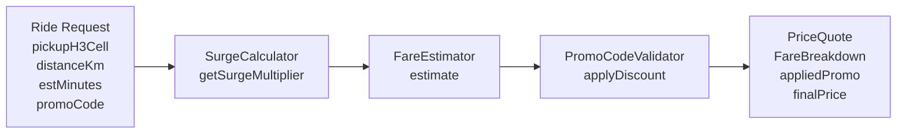

# GrabFlow — Pricing Engine: Dynamic Surge Detection and Fare Estimation

> **Deep dive** into the pricing pipeline.
> Platform: Java 21 — zone-based surge detection, fare estimation, promo code validation.
> ML integration points: LSTM surge forecasting and XGBoost ETA prediction via AgentForge agents.

---

## Table of Contents

1. [Pricing Pipeline Overview](#1-pricing-pipeline-overview)
2. [Surge Detection Algorithm](#2-surge-detection-algorithm)
3. [Fare Estimation Model](#3-fare-estimation-model)
4. [Promo Code System](#4-promo-code-system)
5. [PricingService Integration](#5-pricingservice-integration)
6. [ML Integration Points](#6-ml-integration-points)
7. [See Also](#7-see-also)

---

## 1. Pricing Pipeline Overview

The pricing pipeline transforms a ride request into a final `PriceQuote` by threading it through three sequential stages: surge calculation, fare estimation, and promotional discount application. The pipeline is orchestrated by `PricingService`, which composes the three independent pricing components into a cohesive end-to-end flow.

### Data Flow Diagram



### Stage 1: Surge Detection (SurgeCalculator)
For a given pickup zone (H3 cell ID at resolution 7), the calculator retrieves the current demand/supply ratio and applies a piecewise-linear surge formula to produce a multiplier in the range [1.0, 3.0].

### Stage 2: Fare Estimation (FareEstimator)
Given distance (km), duration (minutes), and the surge multiplier from stage 1, the estimator applies the pricing configuration (base fare, per-km rate, per-minute rate, minimum fare) to calculate a base fare, then multiplies by surge and floors at the minimum.

### Stage 3: Promo Application (PromoCodeValidator)
If a promo code is provided, the validator checks it is known and not expired. If valid, the discount is applied to the fare from stage 2. If the code is invalid or expired, the fare passes through unchanged.

### Result
The `PriceQuote` record contains the full `FareBreakdown` (base, distance, time, surge components), the normalized promo code applied (if any), and the final price charged to the passenger.

---

## 2. Surge Detection Algorithm

### Design Philosophy

Surge pricing is the primary mechanism for load balancing demand across the network. The algorithm is designed around three principles:

1. **Real-time responsiveness** — Demand and supply metrics are accumulated in sliding time windows (typically 1–5 minutes). When the window rotates, old metrics are discarded and new accumulation begins. This enables the system to respond to demand spikes within seconds.

2. **Granular spatial resolution** — Each zone is an H3 cell at resolution 7, which covers an area of approximately 5 km² (edge length ~1.2 km). This resolution is fine enough to detect local imbalances without creating unmanageable state explosion.

3. **Predictable multiplier curve** — The surge formula is piecewise-linear with three regions, designed to be:
   - Lazy when supply is adequate (ratio ≤ 1.0 → 1.0x)
   - Responsive when supply is tight (ratio 1.0–2.0 → ramp to 1.5x)
   - Gradual but steep when supply is scarce (ratio 2.0–4.0 → ramp to 2.0x)
   - Aggressive but capped (ratio > 4.0 → approach 3.0x cap)

### SurgeCalculator Class

The `SurgeCalculator` maintains two maps for per-zone metrics:

```java
private final ConcurrentHashMap<Long, AtomicInteger> demandCounters;
private final ConcurrentHashMap<Long, Integer> supplyCounters;
```

**Demand Tracking (Lock-Free Increments)**
- Each zone has an `AtomicInteger` counter that is incremented each time a ride request is recorded (`recordDemand(h3CellId)`).
- Increments are atomic and lock-free, suitable for high-frequency updates from the gateway.
- Thread-safe: multiple threads can record demand concurrently without contention.

**Supply Tracking (Last-Write-Wins)**
- Each zone has a supply count updated by the fleet tracker when driver availability changes (`recordSupply(h3CellId, driverCount)`).
- Uses plain `int` values in the map; updates are atomic due to Java's memory semantics for reference types.
- Conservative assumption: if no supply is recorded, default to 1 (assumes scarcest case).

### Surge Formula

For a given zone, the formula is applied to the demand/supply ratio:

```
ratio = demand / max(supply, 1)

ratio ≤ 1.0  →  1.0x  (no surge, supply meets demand)
ratio ≤ 2.0  →  1.0 + (ratio - 1.0) * 0.5   (linear ramp: 1.0x → 1.5x)
ratio ≤ 4.0  →  1.5 + (ratio - 2.0) * 0.25  (slower ramp: 1.5x → 2.0x)
ratio  > 4.0  →  min(3.0, 1.5 + ratio * 0.2) (capped at 3.0x)
```

The implementation is in the static method `computeMultiplier(double ratio)`:

- **Region 1** (ratio ≤ 1.0): No surge. Supply is sufficient to meet demand.
- **Region 2** (1.0 < ratio ≤ 2.0): Linear ramp at 0.5 per unit ratio. At ratio = 2.0, multiplier reaches 1.5x. This region incentivizes drivers to come online without being too aggressive.
- **Region 3** (2.0 < ratio ≤ 4.0): Slower ramp at 0.25 per unit ratio (half the rate of region 2). At ratio = 4.0, multiplier reaches 2.0x. The slower slope prevents multiplier from jumping too quickly.
- **Region 4** (ratio > 4.0): Steep ramp at 0.2 per unit ratio, but hard-capped at 3.0x. This region is for extreme scarcity (demand is 4+ times supply); the cap prevents runaway price escalation.

### Time-Window Rotation

Call `reset()` at the start of each pricing window to discard stale demand counts:

```java
surgeCalculator.reset();  // Clear all zone metrics for next window
```

This is typically invoked by a background scheduler every 1–5 minutes. Without reset, demand from old periods would accumulate indefinitely, causing persistent (incorrect) surge in zones where demand has cooled.

### API Reference

```java
public void recordDemand(long h3CellId)
```
Records a ride request in the zone. Call this in the request handler when a new ride is requested.

```java
public void recordSupply(long h3CellId, int driverCount)
```
Updates the driver count for a zone. Call this when the fleet tracker reports a change in availability.

```java
public double getSurgeMultiplier(long h3CellId)
```
Returns the current surge multiplier for a zone in [1.0, 3.0]. If no demand has been recorded, returns 1.0.

```java
public Map<Long, Double> getAllSurgeZones()
```
Returns an unmodifiable snapshot of all zones currently experiencing surge (multiplier > 1.0).

```java
public ZoneMetrics getZoneMetrics(long h3CellId)
```
Returns the demand and supply counts for a zone as a snapshot.

```java
public void reset()
```
Clears all zone metrics. Call at the start of each pricing window.

---

## 3. Fare Estimation Model

### Pricing Configuration

Fares are calculated from a `PricingConfig` record that encodes the pricing strategy for a vehicle category or market:

```java
public record PricingConfig(
    double baseFare,
    double perKmRate,
    double perMinuteRate,
    double minimumFare)
```

- **baseFare** — Fixed flag-fall charge, applied to every ride (e.g., $1.00). Covers driver assignment and platform overhead.
- **perKmRate** — Charge per kilometre (e.g., $0.40/km). Incentivizes longer routes and compensates for vehicle wear.
- **perMinuteRate** — Charge per minute of ride duration (e.g., $0.08/min). Accounts for driver time in low-speed traffic or long waits.
- **minimumFare** — Floor on the total fare after surge is applied (e.g., $2.00). Prevents very short rides from being underpriced due to low distance/time.

**Default Configuration** (Southeast Asian market calibration):
```java
PricingConfig.defaults()
// baseFare=1.00, perKmRate=0.40, perMinuteRate=0.08, minimumFare=2.00
```

All rates must be non-negative; the config constructor validates this.

### Fare Calculation

The `FareEstimator` applies the fare formula:

```
raw = baseFare + distanceKm * perKmRate + estMinutes * perMinuteRate
surged = raw * surgeMultiplier
total = max(surged, minimumFare)
```

**Step 1: Raw Fare** — Sum the base, distance, and time components using the config rates.

**Step 2: Apply Surge** — Multiply by the surge multiplier (≥ 1.0) from the surge calculator.

**Step 3: Floor at Minimum** — Ensure the final total is at least the configured minimum fare. This is especially important during heavy surge (e.g., a 100m ride in surge should not cost $0.20 just because the time and distance are trivial).

### FareBreakdown Record

The result of `estimate()` is a `FareBreakdown` record:

```java
public record FareBreakdown(
    double baseFare,
    double distanceFare,
    double timeFare,
    double surgeMultiplier,
    double totalFare)
```

- **baseFare** — The flag-fall component.
- **distanceFare** — Distance-based component before surge (distanceKm × perKmRate).
- **timeFare** — Time-based component before surge (estMinutes × perMinuteRate).
- **surgeMultiplier** — The surge multiplier applied.
- **totalFare** — The final fare after surge and minimum-fare floor.

The record also provides a convenience method:
```java
public double rawFare()  // Returns baseFare + distanceFare + timeFare
```

### API Reference

```java
FareEstimator(PricingConfig config)
```
Constructor. Throws `IllegalArgumentException` if config is null.

```java
FareBreakdown estimate(double distanceKm, double estMinutes, double surgeMultiplier)
```
Calculates the fare. All inputs must be non-negative; surgeMultiplier must be ≥ 1.0. Throws `IllegalArgumentException` if validation fails.

```java
PricingConfig getConfig()
```
Returns the config used by this estimator.

### Example

```java
FareEstimator estimator = new FareEstimator(PricingConfig.defaults());
FareBreakdown fare = estimator.estimate(4.5, 12.0, 1.5);

// Breakdown:
// baseFare = 1.00
// distanceFare = 4.5 * 0.40 = 1.80
// timeFare = 12.0 * 0.08 = 0.96
// raw = 1.00 + 1.80 + 0.96 = 3.76
// surged = 3.76 * 1.5 = 5.64
// total = max(5.64, 2.00) = 5.64

System.out.println(fare.totalFare());  // 5.64
```

---

## 4. Promo Code System

### Design

The `PromoCodeValidator` manages promotional codes with a simple, fast design:

- **Storage** — `ConcurrentHashMap<String, PromoCode>` keyed by normalized (upper-cased, trimmed) code strings.
- **Lookup** — O(1) average case on the hash table.
- **Expiry** — Checked at validation time using wall-clock `Instant`. No background purge thread is needed because the code dataset is expected to be small (tens to low hundreds of active promotions).
- **Thread Safety** — All public methods are thread-safe through `ConcurrentHashMap`.

### PromoCode Record

```java
public record PromoCode(
    String code,
    double discountPercent,
    Instant expiresAt)
```

- **code** — The promo code string (as registered; lookup is case-insensitive).
- **discountPercent** — Percentage discount to apply to the fare, in the range (0, 100) exclusive. For example, `GRAB20` would have `discountPercent = 20.0`.
- **expiresAt** — Wall-clock `Instant` after which the code is no longer valid. Once the system clock passes this instant, the code is rejected.

The record validates:
- code is not blank
- discountPercent is in (0, 100)
- expiresAt is not null

### Validation and Discount Application

**Validate**
```java
Optional<PromoCode> validate(String code)
```
Returns the `PromoCode` if it is known and has not expired; otherwise returns `Optional.empty()`. Codes are normalized (trimmed and upper-cased) for comparison.

**Apply Discount**
```java
double applyDiscount(double fare, String promoCode)
```
Applies the discount for the given code to a fare. If the code is invalid or expired, the original fare is returned unchanged. The discount is calculated as:
```
discounted = fare * (1.0 - discountPercent / 100.0)
```

### API Reference

```java
void addPromoCode(PromoCode promo)
```
Registers a promo code. If a code with the same value already exists, it is replaced. Throws `IllegalArgumentException` if promo is null.

```java
Optional<PromoCode> validate(String code)
```
Validates a promo code. Returns `Optional.of(promo)` if valid and not expired; otherwise `Optional.empty()`.

```java
double applyDiscount(double fare, String promoCode)
```
Applies the discount for the code to a fare. If the code is invalid, expired, or null/blank, the original fare is returned unchanged. Throws `IllegalArgumentException` if fare < 0.

```java
int codeCount()
```
Returns the total number of registered promo codes (including expired ones).

### Example

```java
PromoCodeValidator validator = new PromoCodeValidator();
validator.addPromoCode(
    new PromoCode("GRAB20", 20.0, Instant.now().plusSeconds(3600))
);

double discounted = validator.applyDiscount(10.00, "grab20");  // Case-insensitive
// discounted = 10.00 * (1.0 - 20.0 / 100.0) = 8.00

double original = validator.applyDiscount(10.00, "INVALID");
// original = 10.00 (code not found)
```

---

## 5. PricingService Integration

### End-to-End Flow

The `PricingService` orchestrates the three pricing components into a single `calculatePrice()` call:

```java
PriceQuote calculatePrice(
    long pickupH3Cell,
    double distanceKm,
    double estMinutes,
    String promoCode)
```

**Step 1: Lookup Surge**
```java
double surge = surgeCalculator.getSurgeMultiplier(pickupH3Cell);
```
Retrieves the surge multiplier for the pickup zone.

**Step 2: Estimate Fare**
```java
FareEstimator.FareBreakdown fare = fareEstimator.estimate(distanceKm, estMinutes, surge);
```
Calculates the full fare breakdown (base, distance, time, surge) resulting in a `totalFare`.

**Step 3: Apply Promo**
```java
double finalPrice = fare.totalFare();
String appliedPromo = null;

if (promoCode != null && !promoCode.isBlank()) {
    double discounted = promoValidator.applyDiscount(fare.totalFare(), promoCode);
    if (discounted < fare.totalFare()) {
        appliedPromo = promoCode.trim().toUpperCase();
        finalPrice = discounted;
    }
}
```
Attempts to apply the promo discount. If the code is invalid or expired, the fare is unchanged and `appliedPromo` remains `null`.

**Result**
```java
PriceQuote quote = new PriceQuote(fare, appliedPromo, finalPrice);
```
A `PriceQuote` record containing the full `FareBreakdown`, the normalized promo code applied (if any), and the final price.

### PriceQuote Record

```java
public record PriceQuote(
    FareEstimator.FareBreakdown fare,
    String appliedPromo,
    double finalPrice)
```

- **fare** — Full `FareBreakdown` showing base, distance, time, surge, and raw total before promo.
- **appliedPromo** — Normalized promo code that was applied, or `null` if none.
- **finalPrice** — The price the passenger will be charged (after promo if applicable).

Convenience method:
```java
public boolean hasPromo()
```
Returns `true` if a promo code was successfully applied.

### API Reference

```java
PricingService(
    SurgeCalculator surgeCalculator,
    FareEstimator fareEstimator,
    PromoCodeValidator promoValidator)
```
Constructor. Throws `IllegalArgumentException` if any component is null.

```java
PriceQuote calculatePrice(
    long pickupH3Cell,
    double distanceKm,
    double estMinutes,
    String promoCode)
```
Calculates the full price quote. All numeric inputs must be non-negative. `promoCode` may be null or blank to skip promo validation.

### Example

```java
// Setup
SurgeCalculator surgeCalculator = new SurgeCalculator();
surgeCalculator.recordDemand(12345L);
surgeCalculator.recordDemand(12345L);
surgeCalculator.recordSupply(12345L, 1);

FareEstimator fareEstimator = new FareEstimator(PricingConfig.defaults());

PromoCodeValidator promoValidator = new PromoCodeValidator();
promoValidator.addPromoCode(
    new PromoCode("GRAB20", 20.0, Instant.now().plusSeconds(3600))
);

PricingService svc = new PricingService(
    surgeCalculator, fareEstimator, promoValidator
);

// Calculate price
PriceQuote quote = svc.calculatePrice(12345L, 5.2, 14.0, "GRAB20");

System.out.println("Surge: " + quote.fare().surgeMultiplier());
System.out.println("Before promo: " + quote.fare().totalFare());
System.out.println("After promo: " + quote.finalPrice());
System.out.println("Promo applied: " + quote.appliedPromo());
```

---

## 6. ML Integration Points

The pricing engine is designed to integrate with AgentForge agents for ML-driven surge forecasting and ETA prediction. These integration points allow the system to move beyond reactive surge pricing toward predictive pricing.

### LSTM Surge Forecasting

**Objective** — Predict demand 15 minutes ahead so that surge pricing can be increased preemptively during anticipated demand spikes.

**Data Feed** — Historical demand time series per H3 zone from the last 7–30 days. Each zone has a sequence of demand counts per time window (1–5 min resolution).

**AgentForge Agent** — An LSTM model trained to predict the next demand value given a sliding window of historical data. The agent wraps a PyTorch or TensorFlow LSTM layer that operates on the time series.

**Integration Point** — The `SurgeCalculator` could be extended to call the LSTM agent:
```java
Optional<Double> forecastedDemand = lstmAgent.predict(h3CellId, currentWindow);
if (forecastedDemand.isPresent()) {
    // Use forecasted demand in surge calculation instead of actual
    // This allows preemptive pricing before demand materializes
}
```

**Benefits**
- Drivers are incentivized to log online earlier, reducing future supply scarcity.
- Passengers see stable pricing for predictable high-demand periods rather than sharp spikes.
- System load is distributed more smoothly.

### XGBoost ETA Prediction

**Objective** — Improve per-minute rate accuracy by incorporating real-time traffic conditions and historical ETA patterns.

**Data Feed** — Feature vector for each ride request:
- Origin location (lat/lon or H3 cell)
- Destination location (lat/lon or H3 cell)
- Time of day (hour, minute)
- Day of week
- Historical traffic state (e.g., speed per segment from traffic API)
- Current weather (optional)

**AgentForge Agent** — An XGBoost model trained on past rides with their actual ETA vs estimated ETA. The agent encodes the feature vector, queries the model, and returns a corrected ETA.

**Integration Point** — The `PricingService` could be extended to call the XGBoost agent during `calculatePrice()`:
```java
FareEstimator.FareBreakdown estimate = fareEstimator.estimate(
    distanceKm,
    estimatedMinutes,  // Current ETA from Google Maps / TomTom
    surge
);

Optional<Double> correctedMinutes = xgboostAgent.predictETA(
    origin, destination, timeOfDay, trafficState
);

if (correctedMinutes.isPresent()) {
    // Recalculate fare with corrected ETA
    FareEstimator.FareBreakdown correctedFare = fareEstimator.estimate(
        distanceKm,
        correctedMinutes.get(),
        surge
    );
    // Use correctedFare instead of estimate
}
```

**Benefits**
- More accurate pricing in heavy traffic (corrected ETA accounts for congestion).
- Reduced passenger disputes ("Why did this 2 km ride cost $8?").
- Better ETA estimates improve driver incentives (they know exactly how long the ride will take).

### Monitoring and Feedback Loop

Both agents should emit metrics to the observability stack:
- **LSTM Agent**: Prediction accuracy (MAE, RMSE of forecasted vs actual demand), prediction latency.
- **XGBoost Agent**: ETA correction accuracy (actual vs predicted vs estimated), model inference time, feature extraction overhead.

These metrics feed back into model retraining pipelines on a weekly or monthly schedule, ensuring that pricing adapts to changing demand patterns and traffic conditions.

---

## 7. See Also

- **Dynamic Pricing Theory**
  - Karamychev, V., & Van Reeven, P. (2022). "Surge Pricing and Flexible Supply in Ride-Hailing Markets." *Journal of Economic Behavior & Organization*, 194, 133–150.
  - Chen, M. K., & Sheldon, M. (2016). "Dynamic Pricing in a Labor Market: The Rise of Uber." *EConomic Inquiry*, 54(2), 1155–1184.

- **Uber's Surge Pricing Architecture**
  - https://www.uber.com/en-US/newsroom/surge-pricing/
  - Chen, M. K., et al. (2019). "The Value of Flexible Work: Evidence from Uber Drivers." *Journal of Political Economy*, 127(6), 2735–794.

- **H3 Geospatial Indexing**
  - Uber H3 Documentation: https://h3geo.org/
  - Brodsky, A., et al. (2018). "H3: Uber's Hexagonal Hierarchical Spatial Index." Uber Engineering Blog.

- **Time-Series Forecasting with LSTM**
  - Hochreiter, S., & Schmidhuber, J. (1997). "Long Short-Term Memory." *Neural Computation*, 9(8), 1735–1780.
  - Goodfellow, I., Bengio, Y., & Courville, A. (2016). *Deep Learning*. MIT Press. Chapter 10 (Recurrent Networks).

- **XGBoost: Machine Learning at Scale**
  - Chen, T., & Guestrin, C. (2016). "XGBoost: A Scalable Tree Boosting System." *Proceedings of the 22nd ACM SIGKDD International Conference on Knowledge Discovery and Data Mining*. ACM.

- **GrabFlow Architecture**
  - See [../README.md](../README.md) for the 7-service platform overview.
