# GrabFlow System Design: AI-Powered Distributed Ride-Sharing Platform

> **Capstone document** integrating all 7 microservices and 4 custom infrastructure systems.
> Follows the Seven-Step Approach from *Hacking the System Design Interview* by Stanley Chiang.
> Platform: Java 21 -- 7 microservices, 4 from-scratch infrastructure systems, 14 CS fundamentals.

---

## Table of Contents

1. [Step 1: Clarify the Problem and Scope](#step-1-clarify-the-problem-and-scope)
2. [Step 2: Define the Data Models](#step-2-define-the-data-models)
3. [Step 3: Back-of-the-Envelope Estimates](#step-3-back-of-the-envelope-estimates)
4. [Step 4: High-Level System Design](#step-4-high-level-system-design)
5. [Step 5: Design Components in Detail](#step-5-design-components-in-detail)
6. [Step 6: Service Definitions, APIs, Interfaces](#step-6-service-definitions-apis-interfaces)
7. [Step 7: Scaling Problems and Bottlenecks](#step-7-scaling-problems-and-bottlenecks)
8. [References](#references)

---

## Step 1: Clarify the Problem and Scope

### Problem Statement

> Design a ride-sharing application like Uber or Grab that supports real-time driver tracking, intelligent dispatch, dynamic surge pricing, and reliable payment processing across a Southeast Asian market with millions of users.

### Functional Requirements

| ID | Requirement | Description |
|----|-------------|-------------|
| FR-1 | **Rider/Driver Registration** | Users register with name, email, phone, payment method. Drivers add license, vehicle info. |
| FR-2 | **Real-Time Location Tracking** | Driver apps send GPS updates every 3 seconds. Riders see driver position on a live map. |
| FR-3 | **Ride Request & Matching** | Rider requests a ride with pickup/dropoff. System matches the nearest available driver based on configurable rules (distance, rating, vehicle type). |
| FR-4 | **Dynamic Surge Pricing** | Fare multipliers adjust in real time based on demand/supply ratio per geographic zone. LSTM model predicts demand 15 minutes ahead. |
| FR-5 | **Fare Estimation** | Before confirming, rider sees an upfront fare estimate based on distance, time, surge, and promo codes. |
| FR-6 | **Payment Processing** | Saga-pattern orchestration: authorize, capture, pay driver. Idempotency keys prevent double-charging. |
| FR-7 | **Ride Lifecycle Management** | State machine: REQUESTED --> MATCHED --> DRIVER_ARRIVING --> IN_PROGRESS --> COMPLETED/CANCELLED. |
| FR-8 | **Push Notifications** | Real-time notifications for ride status changes, driver arrival, payment confirmation. |
| FR-9 | **Ride History & Rating** | Riders and drivers can view past rides and rate each other (1-5 stars). |
| FR-10 | **Fraud Detection** | Real-time anomaly detection on payment patterns via autoencoder model. |

### Non-Functional Requirements

| ID | Requirement | Target |
|----|-------------|--------|
| NFR-1 | **Match Latency** | < 3 seconds from ride request to driver assignment |
| NFR-2 | **Location Query Latency** | < 50ms for nearest-driver queries across 100K+ drivers |
| NFR-3 | **Payment Reliability** | 99.99% successful payment completion (with saga compensation) |
| NFR-4 | **Concurrent Drivers** | Support 100K+ concurrent online drivers |
| NFR-5 | **Peak Throughput** | Handle 10K rides/hour at peak |
| NFR-6 | **Gateway Throughput** | 10K+ concurrent connections via NIO reactor |
| NFR-7 | **Rate Limiting** | Sub-1us Bloom filter check per request |
| NFR-8 | **TLS Handshake** | 1-RTT TLS 1.3 (vs 2-RTT in TLS 1.2) |
| NFR-9 | **Availability** | 99.95% uptime across all services |
| NFR-10 | **Data Durability** | Zero payment data loss (WAL-backed NexusDB) |

### Clarifying Questions

Before diving into design, a system design interview would require clarifying these scoping questions:

1. **Geographic scope** -- Single city or multi-region? *Answer: Single city initially (e.g., Ho Chi Minh City), with the architecture supporting multi-region expansion.*
2. **Vehicle types** -- Just cars, or also motorcycles, premium, carpooling? *Answer: Three types -- SEDAN, SUV, PREMIUM. Carpooling is out of scope for v1.*
3. **Real-time vs batch pricing** -- Is surge calculated per-request or on a schedule? *Answer: Real-time per zone with 1-5 minute sliding windows, plus LSTM forecasting 15 minutes ahead.*
4. **Tipping** -- Supported? *Answer: Out of scope for v1.*
5. **Cancellation policy** -- Free cancellation window? *Answer: Cancellation is allowed at any non-terminal state. Fee logic is out of scope for v1.*
6. **International payments** -- Multi-currency? *Answer: Single currency for v1. Multi-currency is an extension.*
7. **Regulatory compliance** -- GDPR, PCI-DSS? *Answer: PCI-DSS for payment data. GDPR compliance is an extension.*
8. **Offline support** -- What happens if driver loses connectivity? *Answer: Timing wheel detects inactivity after 30 seconds and removes the driver from the spatial index.*

### Scope Boundaries

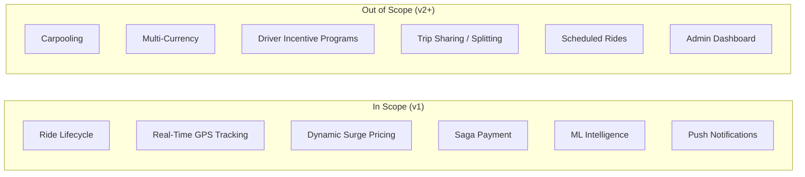

---

## Step 2: Define the Data Models

### 2.1 Entity Definitions

#### Rider

| Field | Type | Size (bytes) | Description |
|-------|------|-------------|-------------|
| riderId | string | 64 | UUID primary key |
| name | string | 128 | Display name |
| email | string | 128 | Unique email address |
| phone | string | 20 | Phone number with country code |
| rating | float | 4 | Average rating (1.0-5.0) |
| paymentMethodId | string | 64 | Reference to stored payment method |
| createdAt | long | 8 | Registration timestamp (epoch ms) |
| **Total** | | **~416 bytes** | |

#### Driver

| Field | Type | Size (bytes) | Description |
|-------|------|-------------|-------------|
| driverId | string | 64 | UUID primary key |
| name | string | 128 | Display name |
| licenseNumber | string | 32 | Government-issued license ID |
| vehicleId | string | 64 | Foreign key to Vehicle |
| status | enum | 1 | AVAILABLE, BUSY, OFFLINE |
| rating | float | 4 | Average rating (1.0-5.0) |
| currentLocation | long | 8 | H3 cell ID at resolution 9 |
| lastLocationUpdate | long | 8 | Timestamp of last GPS update |
| **Total** | | **~317 bytes** | |

#### Vehicle

| Field | Type | Size (bytes) | Description |
|-------|------|-------------|-------------|
| vehicleId | string | 64 | UUID primary key |
| type | enum | 1 | SEDAN, SUV, PREMIUM |
| plateNumber | string | 16 | License plate |
| make | string | 64 | Manufacturer (e.g., Toyota) |
| model | string | 64 | Model name (e.g., Camry) |
| year | int | 4 | Manufacturing year |
| **Total** | | **~213 bytes** | |

#### Ride

| Field | Type | Size (bytes) | Description |
|-------|------|-------------|-------------|
| rideId | string | 64 | UUID primary key |
| riderId | string | 64 | Foreign key to Rider |
| driverId | string | 64 | Foreign key to Driver (nullable until matched) |
| status | enum | 1 | REQUESTED, MATCHED, DRIVER_ARRIVING, IN_PROGRESS, COMPLETED, CANCELLED |
| pickupLocation | long | 8 | H3 cell ID for pickup |
| dropoffLocation | long | 8 | H3 cell ID for dropoff |
| pickupTime | long | 8 | Actual pickup timestamp |
| dropoffTime | long | 8 | Actual dropoff timestamp |
| distance | float | 4 | Trip distance in km |
| fare | long | 8 | Fare amount in cents |
| surgeMultiplier | float | 4 | Applied surge multiplier |
| paymentId | string | 64 | Foreign key to Payment |
| createdAt | long | 8 | Request creation timestamp |
| **Total** | | **~377 bytes** | |

#### DriverLocation (FlashCache hot data)

| Field | Type | Size (bytes) | Description |
|-------|------|-------------|-------------|
| driverId | string | 64 | Driver identifier |
| h3Cell | long | 8 | Current H3 cell at resolution 9 |
| lat | double | 8 | Latitude |
| lng | double | 8 | Longitude |
| heading | float | 4 | Compass heading in degrees |
| speed | float | 4 | Speed in km/h |
| timestamp | long | 8 | GPS reading timestamp |
| **Total** | | **~104 bytes** | |

#### Payment

| Field | Type | Size (bytes) | Description |
|-------|------|-------------|-------------|
| paymentId | string | 64 | UUID primary key |
| rideId | string | 64 | Foreign key to Ride |
| riderId | string | 64 | Rider being charged |
| amount | long | 8 | Amount in cents |
| status | enum | 1 | AUTHORIZED, CAPTURED, FAILED, REFUNDED |
| sagaState | enum | 1 | Current saga step |
| idempotencyKey | string | 64 | Client-provided dedup key |
| createdAt | long | 8 | Transaction timestamp |
| **Total** | | **~274 bytes** | |

#### SurgePrice (FlashCache)

| Field | Type | Size (bytes) | Description |
|-------|------|-------------|-------------|
| h3Cell | long | 8 | H3 cell at resolution 7 (~5 km^2) |
| multiplier | float | 4 | Current surge multiplier (1.0-3.0) |
| demand | int | 4 | Ride requests in current window |
| supply | int | 4 | Available drivers in zone |
| calculatedAt | long | 8 | When surge was computed |
| expiresAt | long | 8 | TTL expiration timestamp |
| **Total** | | **~36 bytes** | |

### 2.2 Entity-Relationship Diagram

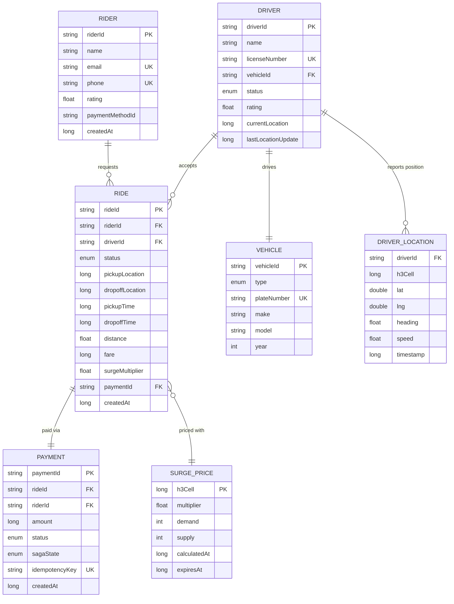

### 2.3 Schema Design: Third Normal Form (3NF)

The relational schema is in **Third Normal Form** (3NF):

1. **1NF**: All fields are atomic (no arrays, no nested objects). H3 cell IDs are stored as 64-bit longs, not as compound lat/lng pairs.
2. **2NF**: Every non-key column depends on the entire primary key. `Ride.fare` depends on `rideId`, not on `riderId` or `driverId` alone.
3. **3NF**: No transitive dependencies. `Driver.rating` is stored on Driver, not on Ride (even though it could be derived). `Vehicle.make` is on Vehicle, not on Driver.

**Strategic denormalization**: The `Ride` table includes `surgeMultiplier` (which could be looked up from `SurgePrice`). This avoids a join on every ride history query and captures the surge at the time of booking (surge changes over time).

### 2.4 Storage Layer Mapping

| Entity | Primary Store | Cache Layer | Event Stream |
|--------|--------------|-------------|--------------|
| Rider | NexusDB | FlashCache (session tokens) | -- |
| Driver | NexusDB | FlashCache (online status) | TurboMQ `driver.status` |
| Vehicle | NexusDB | -- | -- |
| Ride | NexusDB (SSI transactions) | FlashCache (active rides) | TurboMQ `ride.lifecycle` |
| DriverLocation | FlashCache (primary) | Memory-mapped IPC buffer | TurboMQ `driver.location` |
| Payment | NexusDB (WAL-backed) | FlashCache (idempotency keys) | TurboMQ `payment.saga` |
| SurgePrice | FlashCache (primary) | -- | TurboMQ `surge.update` |

---

## Step 3: Back-of-the-Envelope Estimates

### 3.1 Scale Assumptions

**Scenario**: Major ride-sharing service in Southeast Asia (comparable to Grab in a single metropolitan area).

| Parameter | Value | Rationale |
|-----------|-------|-----------|
| Registered riders | 5,000,000 | Large metro area (Ho Chi Minh City / Jakarta scale) |
| Registered drivers | 500,000 | ~10% of rider base |
| Peak online drivers | 100,000 | ~20% of registered drivers at peak hours |
| Concurrent rides | 50,000 | ~50% of online drivers are on a ride |
| Daily rides | 500,000 | ~278 rides/hour average, with 3x peak |
| Peak rides/hour | 50,000 | ~14 rides/second at peak |
| GPS update frequency | Every 3 seconds | Industry standard for ride-sharing |

### 3.2 Traffic Analysis (QPS Breakdown)

```
Location updates:
  100,000 drivers x (1 update / 3 sec) = 33,333 writes/sec to FlashCache

API Gateway (total inbound):
  GPS updates:           33,333 req/sec
  Ride requests (peak):      14 req/sec
  Ride status queries:    1,000 req/sec  (riders polling)
  Fare estimates:           100 req/sec
  Misc (auth, profile):    500 req/sec
  ─────────────────────────────────────
  Total:                ~35,000 req/sec at peak

Location Service:
  Spatial index updates:  33,333 writes/sec  (GPS -> H3 cell update)
  Nearest-driver queries:     14 reads/sec   (per ride request, k-ring)
  k-ring cells per query:    ~19 cells       (k=2 at resolution 9)
  Candidate drivers/query:  ~100 drivers     (urban density)

Ride Service:
  Ride requests:              14/sec
  DSL compilations:           14/sec  (one per ride request)
  State transitions:          70/sec  (14 rides x 5 states avg)
  NexusDB SSI writes:         84/sec  (rides + transitions)

Pricing Engine:
  Surge calculations:         14/sec  (per ride request)
  Surge cache reads:      35,000/sec  (cache hit for most)
  LSTM predictions:            1/sec  (batch per zone every ~30s)

Payment Service:
  Saga executions:            14/sec  (per completed ride)
  Saga steps per execution:    3      (authorize, capture, pay_driver)
  Total saga step RPCs:       42/sec
  Idempotency checks:         14/sec

TurboMQ Events:
  driver.location:        33,333 events/sec
  ride.lifecycle:             70 events/sec  (14 rides x 5 events)
  payment.saga:               42 events/sec
  surge.update:               10 events/sec  (zone updates)
  ─────────────────────────────────────────
  Total:                 ~33,455 events/sec
```

### 3.3 Storage Estimates

```
NexusDB (persistent OLTP):
  Rides:     500,000 rides/day x 377 bytes = 188 MB/day
             Yearly: 188 MB x 365 = ~69 GB
             With MVCC version chains (3x): ~207 GB/year
  Payments:  500,000/day x 274 bytes = 137 MB/day
             Yearly: ~50 GB. With MVCC: ~150 GB/year
  Drivers:   500,000 x 317 bytes = ~159 MB (static, grows slowly)
  Riders:    5,000,000 x 416 bytes = ~2 GB (static)
  Vehicles:  500,000 x 213 bytes = ~107 MB (static)
  ──────────────────────────────────────────────────
  Total NexusDB Year 1: ~360 GB (with MVCC overhead)

FlashCache (in-memory hot data):
  Driver locations: 100,000 x 104 bytes = 10.4 MB
  Surge multipliers: 1,000,000 H3 cells x 36 bytes = 36 MB
  Session tokens: 50,000 concurrent x 256 bytes = 12.8 MB
  Active rides: 50,000 x 377 bytes = 18.9 MB
  Idempotency keys: 50,000 x 128 bytes = 6.4 MB
  ──────────────────────────────────────────────────
  Total FlashCache: ~85 MB (fits entirely in RAM)

TurboMQ (event log with retention):
  Events: 33,455 events/sec x ~1 KB avg = 33.5 MB/sec
  Daily: 33.5 MB/sec x 86,400 sec = ~2.8 TB/day
  7-day retention: ~20 TB
  (driver.location dominates; consider shorter TTL for location events)
```

### 3.4 Bandwidth Estimates

```
Inbound (clients -> gateway):
  GPS updates: 33,333/sec x 104 bytes = 3.4 MB/sec
  Ride requests: 14/sec x 1 KB = 14 KB/sec
  Other: ~500 KB/sec
  ──────────────────────────────────────
  Total inbound: ~4 MB/sec (~32 Mbps)

Internal (service-to-service):
  TurboMQ throughput: 33.5 MB/sec (~268 Mbps)
  FlashCache reads: 35,000/sec x 104 bytes = 3.6 MB/sec
  NexusDB queries: 100/sec x 1 KB = 100 KB/sec
  gRPC inter-service: ~500 KB/sec
  ──────────────────────────────────────
  Total internal: ~38 MB/sec (~304 Mbps)
```

### 3.5 Summary Table

| Resource | Estimate | Notes |
|----------|----------|-------|
| Peak GPS writes | 33K/sec | FlashCache + memory-mapped IPC |
| Peak gateway QPS | 35K/sec | Dominated by location updates |
| Peak TurboMQ events | 33.5K/sec | Dominated by `driver.location` |
| NexusDB storage (Year 1) | ~360 GB | With MVCC 3x overhead |
| FlashCache memory | ~85 MB | All hot data fits in RAM |
| TurboMQ storage (7-day) | ~20 TB | Location events dominate |
| Network bandwidth | ~340 Mbps | Internal traffic dominates |

---

## Step 4: High-Level System Design

### 4.1 The Unscaled Design (Why It Fails)

The simplest possible architecture is a monolith: a single server handling all requests, one database, no caching.

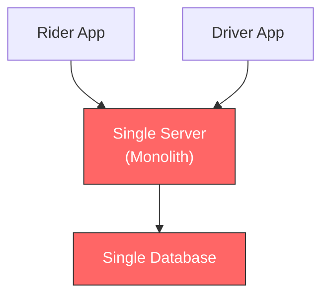

**Why this fails at scale:**

| Problem | Impact |
|---------|--------|
| Single server cannot handle 33K GPS updates/sec | Location updates queue up; drivers appear stale on rider's map |
| No spatial indexing | Nearest-driver query scans all 100K drivers -- O(n) per request |
| No caching layer | Every read hits the database; 35K QPS overwhelms a single DB |
| No event system | Payment failures crash the ride flow; no async decoupling |
| No surge pricing | No mechanism to balance demand/supply dynamically |
| Single point of failure | Server crash means 50K active rides are lost |
| No rate limiting | DDoS or misbehaving clients take down the entire system |
| No TLS termination | Plaintext GPS data is intercepted on public networks |

### 4.2 The Scaled Design (Full Architecture)

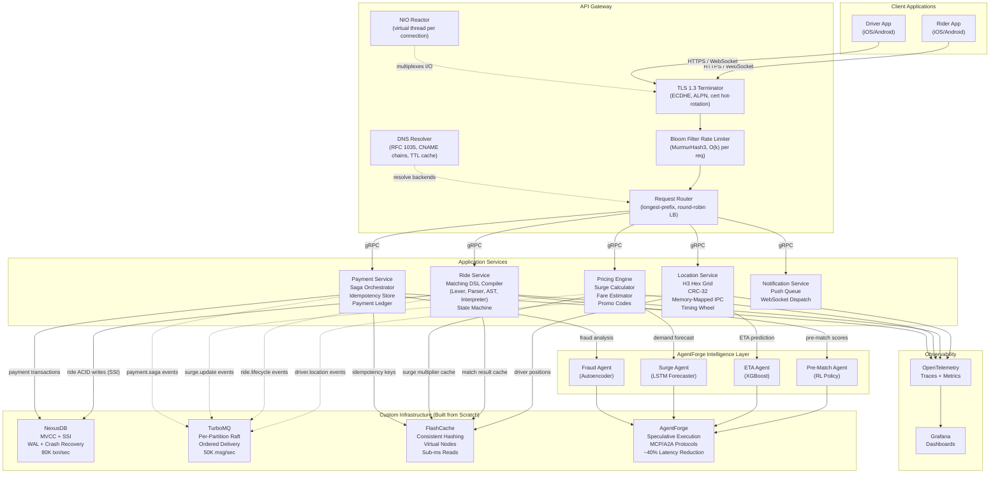

### 4.3 Communication Patterns

| Path | Protocol | Why This Choice |
|------|----------|-----------------|
| Client --> Gateway | HTTPS (TLS 1.3), WebSocket | REST for CRUD operations, WebSocket for real-time GPS streaming. TLS 1.3 provides 1-RTT handshake with forward secrecy. |
| Gateway --> Services | gRPC over HTTP/2 | Low-latency, type-safe, multiplexed streams. Protobuf serialization is ~10x smaller than JSON. |
| Service --> Service (async) | TurboMQ events | Decoupled domain events: `ride.requested`, `driver.located`, `payment.completed`. Per-partition Raft guarantees ordered delivery. |
| Service --> Cache | FlashCache RESP protocol | Sub-millisecond reads for driver locations, surge multipliers, session tokens. Consistent hashing with virtual nodes. |
| Service --> Storage | NexusDB transactions | ACID writes with SSI -- prevents double-matching drivers. WAL ensures crash recovery for payment data. |
| Service --> Intelligence | AgentForge A2A protocol | Multi-step reasoning: ETA prediction, surge detection, fraud analysis. Speculative execution hides inference latency. |

### 4.4 Infrastructure Integration Matrix

| Service | NexusDB | TurboMQ | FlashCache | AgentForge |
|---------|---------|---------|------------|------------|
| **API Gateway** | -- | -- | session tokens | -- |
| **Location Service** | driver positions (backup) | `driver.location` events | driver positions by H3 cell | ETA prediction |
| **Ride Service** | ride ACID writes (SSI) | `ride.lifecycle` events | match result cache | pre-match scores |
| **Pricing Engine** | surge history | `surge.update` events | surge multipliers | demand forecast |
| **Payment Service** | payment transactions | `payment.saga` events | idempotency keys | fraud detection |
| **Notification Service** | -- | subscribes to all topics | -- | -- |

---

## Step 5: Design Components in Detail

This section deep-dives into two interconnected components that form GrabFlow's most technically challenging flow: the **H3 Geospatial Engine** (Location Service) and the **Matching DSL Compiler** (Ride Service). Together, they implement the complete ride-matching pipeline.

### 5.1 H3 Hexagonal Grid Engine

#### Why Hexagons?

Hexagons provide **uniform adjacency**: all 6 neighbors are equidistant from the center cell. Square grids have 8 neighbors at two different distances (edge vs. diagonal), causing inconsistent nearest-neighbor behavior.

| Grid Type | Neighbors | Equidistant? | Edge Effects |
|-----------|-----------|-------------|--------------|
| Square | 8 (4 edge + 4 diagonal) | No (diagonal is 1.41x) | Poor |
| Triangle | 3 edge + 3 far | No | Fair |
| **Hexagon** | **6 (all edge)** | **Yes** | **Excellent** |

GrabFlow uses **resolution 9** (~174m edge length, ~0.105 km^2 area), balancing precision and memory footprint for street-level driver matching.

#### Coordinate System: Axial + Cube Rounding

Each hex cell is identified by axial coordinates `(q, r)` with an implicit third coordinate `s = -q - r` (cube coordinates where `q + r + s = 0`).

**lat/lng to H3 cell conversion:**

```
1. Project (lat, lng) to planar (x, y) via Mercator
2. Compute hex edge length for resolution 9
3. Convert (x, y) to fractional axial (q_f, r_f):
     q_f = (sqrt(3)/3 * x  -  1/3 * y) / hexSize
     r_f = (2/3 * y) / hexSize
4. Cube-round (q_f, r_f) to integer (q, r):
     s_f = -q_f - r_f
     Round each to nearest integer
     Fix the coordinate with largest rounding error: reset to -sum(other two)
5. Encode as 64-bit cell ID:
     Bits 63-56: mode (0x01)
     Bits 55-52: resolution (0-15)
     Bits 51-26: q coordinate (signed 26-bit)
     Bits 25-0:  r coordinate (signed 26-bit)
```

#### k-Ring Traversal

A k-ring enumerates all cells within k rings of a center, forming a hexagonal "bulls-eye":

```
k=0:  1 cell   (center only)
k=1:  7 cells  (center + 6 neighbors)
k=2: 19 cells  (center + 6 + 12)
k=3: 37 cells  (center + 6 + 12 + 18)

Formula: total = 3k^2 + 3k + 1
```

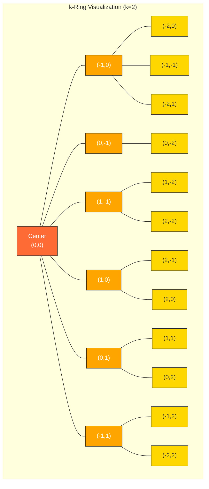

**Algorithm**: Start at center. Move k steps southwest (direction 4). Then walk 6 sides, each with `ring` steps:

```java
for (int ring = 1; ring <= k; ring++) {
    q += AXIAL_DIRECTIONS[4][0];  // Move southwest
    r += AXIAL_DIRECTIONS[4][1];
    for (int side = 0; side < 6; side++) {
        for (int step = 0; step < ring; step++) {
            result[idx++] = encodeCellId(resolution, q, r);
            q += AXIAL_DIRECTIONS[side][0];
            r += AXIAL_DIRECTIONS[side][1];
        }
    }
}
```

#### Spatial Index: Cell-Based Hash Map

The spatial index uses H3 cells as hash buckets, providing O(1) average-case lookups:

```
ConcurrentHashMap<Long, CopyOnWriteArrayList<DriverLocation>> cells
     H3 cell ID  -->  [driver1, driver2, ...]

ConcurrentHashMap<String, Long> driverCells
     driverId  -->  current H3 cell ID
```

**Nearest-driver query**:
1. Compute rider's H3 cell: `latLngToCell(lat, lng, res=9)`
2. Calculate k from radius: `k = ceil(radiusMeters / 174m)`
3. Get all k-ring cells: `kRing(cellId, k)` -- returns `3k^2 + 3k + 1` cell IDs
4. For each cell, fetch drivers from the hash map
5. Compute Haversine distance to each candidate
6. Filter by radius, sort by distance, return top N

**Performance**: For a 5km radius search, k ~ 30, total cells ~ 2,700. With average 37 drivers per cell (100K drivers / 2,700 cells), we scan ~100K candidates. Haversine + sort: < 50ms.

### 5.2 Matching DSL Compiler

The Ride Service uses a full compiler pipeline to evaluate configurable matching rules against candidate drivers.

#### Compiler Pipeline

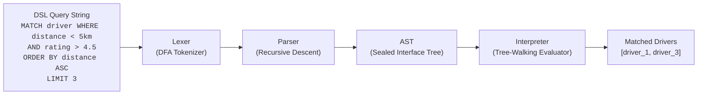

**Phase 1 -- Lexer (DFA)**: Character-by-character scan producing tokens. Keywords (`MATCH`, `WHERE`, `AND`, `OR`, `ORDER`, `BY`, `ASC`, `DESC`, `LIMIT`) are recognized via case-insensitive map lookup. Numbers with unit suffixes (`5km`, `100m`) produce separate NUMBER and unit tokens.

**Phase 2 -- Parser (Recursive Descent)**: Each BNF grammar rule maps to a Java method. LL(1) lookahead -- decisions are made by inspecting only the current token. Produces a sealed AST:

```
MatchQuery
  target: "driver"
  whereClause: BooleanExpr
    left: Comparison("distance", LT, NumberValue(5.0, "km"))
    op: AND
    right: Comparison("rating", GT, NumberValue(4.5, ""))
  orderBy: [OrderClause("distance", ASC)]
  limit: 3
```

**Phase 3 -- Interpreter (Tree-Walking)**: Walks the AST and evaluates each node against driver data. Pattern matching on sealed interface ensures exhaustive case handling. Field resolution maps `"distance"` to the Haversine-computed distance, `"rating"` to the driver's stored rating. Unit conversion transforms `5km` to `5000.0` meters before comparison. Comparator chains are built from ORDER BY clauses.

#### Integration with NexusDB SSI

When the DSL evaluator produces a matched driver, the Ride Service writes the `MATCHED` status atomically using NexusDB's **Serializable Snapshot Isolation (SSI)**:

```
Transaction T1: Ride A wants Driver X
  READ driver_X.status → AVAILABLE
  WRITE ride_A.driverId = driver_X
  WRITE ride_A.status = MATCHED
  WRITE driver_X.status = BUSY
  COMMIT → SSI checks for conflicts

Transaction T2: Ride B also wants Driver X (concurrent)
  READ driver_X.status → AVAILABLE (stale read from T2's snapshot)
  WRITE ride_B.driverId = driver_X
  WRITE ride_B.status = MATCHED
  WRITE driver_X.status = BUSY
  COMMIT → SSI detects write-skew anomaly → ABORT T2
```

SSI detects that T2 read `driver_X.status = AVAILABLE` but T1 already committed a write changing it to `BUSY`. This is a **write-skew anomaly**: T2's decision was based on stale data. SSI aborts T2, and the Ride Service retries matching with the next candidate driver. No distributed locks are needed.

### 5.3 End-to-End Ride Matching Flow

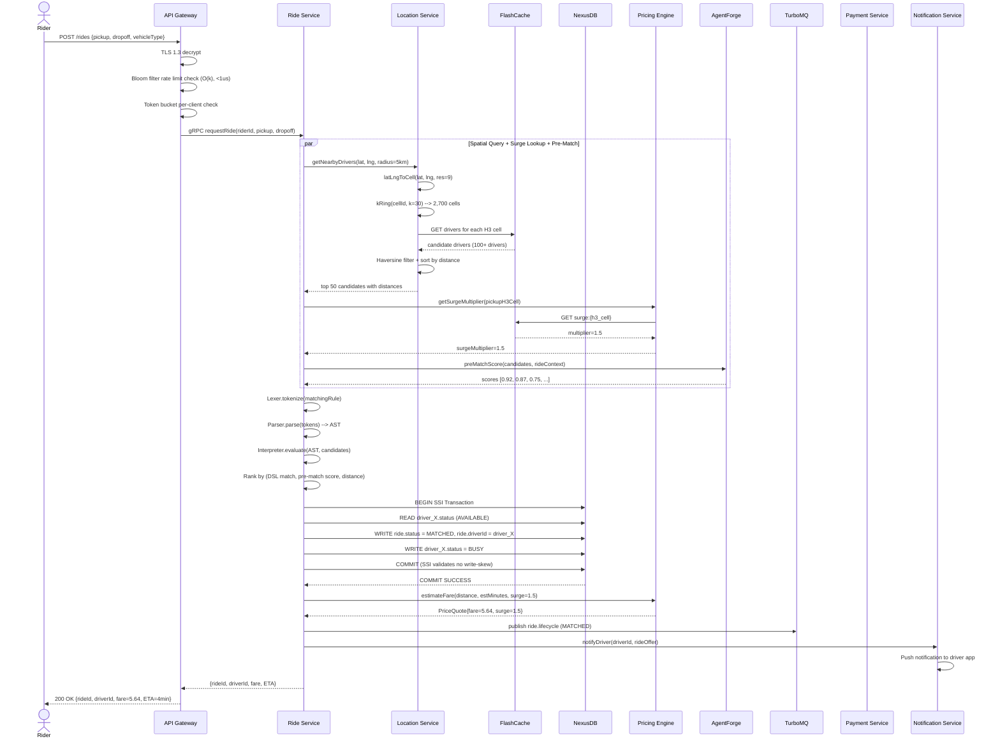

### 5.4 Payment Saga Orchestration (Deep Dive)

When a ride completes, the Payment Service executes a 3-step saga with compensating transactions:

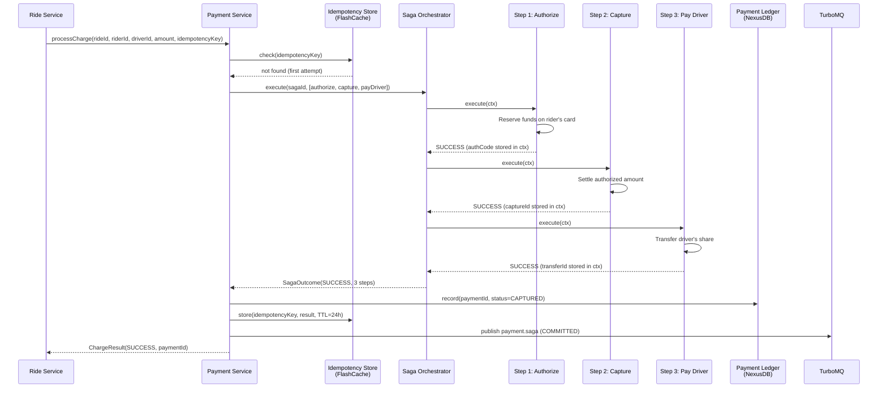

**Failure and compensation** -- if Step 3 (Pay Driver) fails:

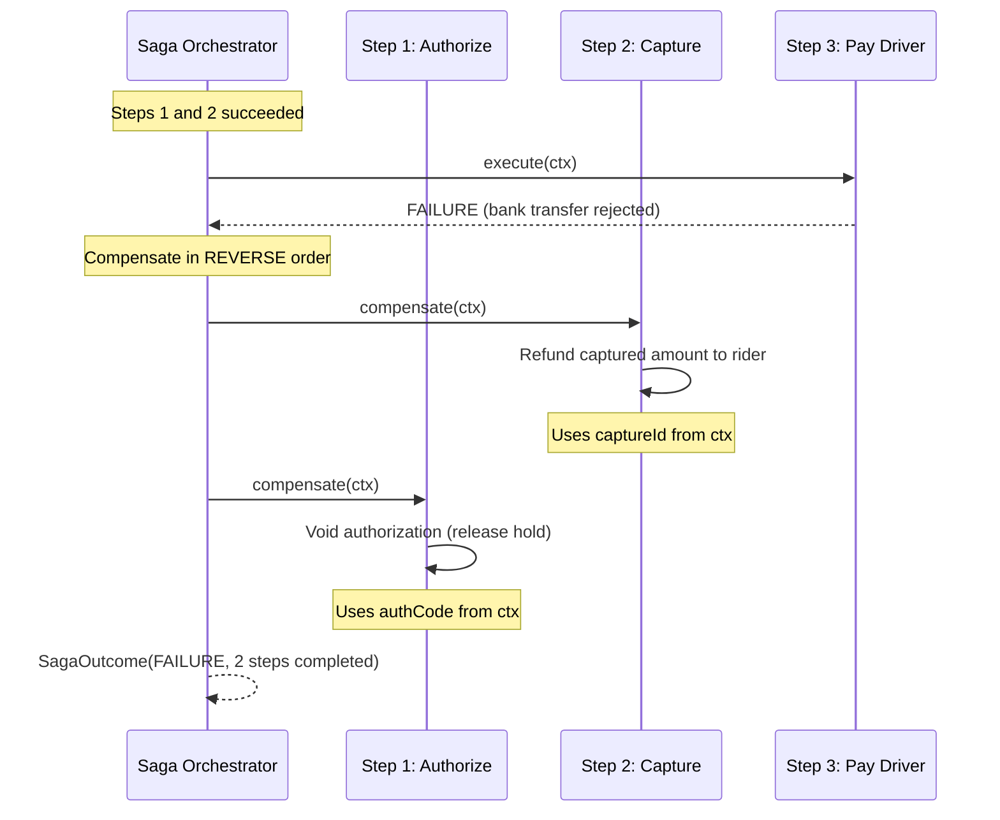

### 5.5 Surge Pricing Pipeline

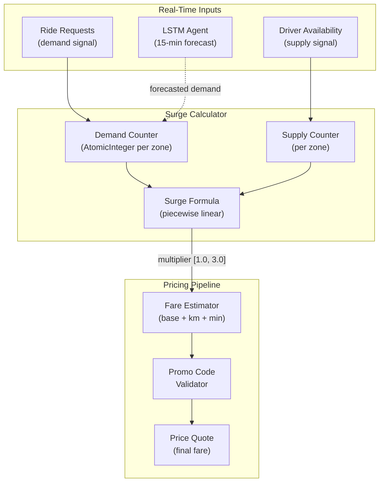

**Surge formula** (piecewise linear):

```
ratio = demand / max(supply, 1)

ratio <= 1.0  -->  1.0x           (no surge)
ratio <= 2.0  -->  1.0 + (r-1)*0.5   (ramp to 1.5x)
ratio <= 4.0  -->  1.5 + (r-2)*0.25  (ramp to 2.0x)
ratio  > 4.0  -->  min(3.0, 1.5 + r*0.2)  (capped at 3.0x)
```

**Fare calculation**:
```
raw_fare    = baseFare + (distanceKm * perKmRate) + (estMinutes * perMinuteRate)
surged_fare = raw_fare * surgeMultiplier
final_fare  = max(surged_fare, minimumFare)
discounted  = final_fare * (1.0 - promoDiscountPercent / 100.0)
```

---

## Step 6: Service Definitions, APIs, Interfaces

### 6.1 RideService (gRPC)

```protobuf
service RideService {
    // Request a new ride - triggers matching pipeline
    rpc RequestRide(RequestRideRequest) returns (RequestRideResponse);

    // Driver accepts an offered ride
    rpc AcceptRide(AcceptRideRequest) returns (AcceptRideResponse);

    // Cancel a ride (rider or driver)
    rpc CancelRide(CancelRideRequest) returns (CancelRideResponse);

    // Mark ride as completed (driver)
    rpc CompleteRide(CompleteRideRequest) returns (CompleteRideResponse);

    // Query ride status
    rpc GetRideStatus(RideStatusRequest) returns (RideStatusResponse);

    // Stream ride state changes (WebSocket-backed)
    rpc StreamRideUpdates(RideStatusRequest) returns (stream RideUpdate);
}

message RequestRideRequest {
    string rider_id = 1;
    double pickup_lat = 2;
    double pickup_lng = 3;
    double dropoff_lat = 4;
    double dropoff_lng = 5;
    string vehicle_type = 6;       // SEDAN, SUV, PREMIUM
    string matching_rule = 7;       // Optional DSL override
    string promo_code = 8;          // Optional
}

message RequestRideResponse {
    string ride_id = 1;
    string driver_id = 2;
    string driver_name = 3;
    string vehicle_plate = 4;
    double fare_estimate = 5;
    double surge_multiplier = 6;
    int32 eta_seconds = 7;
    RideStatus status = 8;
}

message AcceptRideRequest {
    string ride_id = 1;
    string driver_id = 2;
}

message CancelRideRequest {
    string ride_id = 1;
    string cancelled_by = 2;       // rider_id or driver_id
    string reason = 3;
}

message CompleteRideRequest {
    string ride_id = 1;
    string driver_id = 2;
    double final_distance_km = 3;
    int32 final_duration_minutes = 4;
}

enum RideStatus {
    REQUESTED = 0;
    MATCHED = 1;
    DRIVER_ARRIVING = 2;
    IN_PROGRESS = 3;
    COMPLETED = 4;
    CANCELLED = 5;
}
```

### 6.2 LocationService (gRPC)

```protobuf
service LocationService {
    // Driver sends GPS update
    rpc UpdateLocation(UpdateLocationRequest) returns (UpdateLocationResponse);

    // Find nearest available drivers within radius
    rpc GetNearbyDrivers(NearbyDriversRequest) returns (NearbyDriversResponse);

    // Get ETA from driver to pickup point
    rpc GetETA(ETARequest) returns (ETAResponse);

    // Stream real-time driver position (for rider's live map)
    rpc StreamDriverLocation(DriverTrackRequest) returns (stream DriverLocationUpdate);
}

message UpdateLocationRequest {
    string driver_id = 1;
    double lat = 2;
    double lng = 3;
    float heading = 4;             // Compass degrees 0-360
    float speed = 5;               // km/h
    int64 timestamp = 6;           // Epoch milliseconds
    int32 crc32 = 7;               // CRC-32 checksum of payload
}

message NearbyDriversRequest {
    double lat = 1;
    double lng = 2;
    double radius_meters = 3;
    int32 max_results = 4;
    string vehicle_type = 5;       // Optional filter
}

message NearbyDriversResponse {
    repeated DriverLocation drivers = 1;
    int32 total_candidates = 2;
    int64 query_duration_us = 3;   // Microseconds for diagnostics
}

message DriverLocation {
    string driver_id = 1;
    double lat = 2;
    double lng = 3;
    float heading = 4;
    float speed = 5;
    double distance_meters = 6;
    int64 h3_cell_id = 7;
    int64 timestamp = 8;
}

message ETARequest {
    double origin_lat = 1;
    double origin_lng = 2;
    double dest_lat = 3;
    double dest_lng = 4;
}

message ETAResponse {
    int32 eta_seconds = 1;
    double distance_meters = 2;
    string model_version = 3;      // XGBoost model version used
}
```

### 6.3 PricingService (gRPC)

```protobuf
service PricingService {
    // Get fare estimate before ride confirmation
    rpc EstimateFare(FareEstimateRequest) returns (FareEstimateResponse);

    // Get current surge multiplier for a zone
    rpc GetSurgeMultiplier(SurgeRequest) returns (SurgeResponse);

    // Get all zones currently in surge
    rpc GetAllSurgeZones(Empty) returns (SurgeZonesResponse);

    // Validate and preview promo code discount
    rpc ValidatePromo(PromoRequest) returns (PromoResponse);
}

message FareEstimateRequest {
    int64 pickup_h3_cell = 1;
    double distance_km = 2;
    double est_minutes = 3;
    string promo_code = 4;         // Optional
}

message FareEstimateResponse {
    double base_fare = 1;
    double distance_fare = 2;
    double time_fare = 3;
    double surge_multiplier = 4;
    double total_before_promo = 5;
    double final_price = 6;
    string applied_promo = 7;      // Null if no promo applied
}

message SurgeRequest {
    int64 h3_cell_id = 1;         // Resolution 7 (~5 km^2 zone)
}

message SurgeResponse {
    double multiplier = 1;         // Range [1.0, 3.0]
    int32 demand = 2;
    int32 supply = 3;
    int64 calculated_at = 4;
}
```

### 6.4 PaymentService (gRPC)

```protobuf
service PaymentService {
    // Process payment for a completed ride (saga orchestration)
    rpc ProcessCharge(ChargeRequest) returns (ChargeResponse);

    // Refund a captured payment
    rpc Refund(RefundRequest) returns (RefundResponse);

    // Query payment/saga status
    rpc GetPaymentStatus(PaymentStatusRequest) returns (PaymentStatusResponse);

    // Query payment history for a ride
    rpc GetPaymentHistory(PaymentHistoryRequest) returns (PaymentHistoryResponse);
}

message ChargeRequest {
    string ride_id = 1;
    string rider_id = 2;
    string driver_id = 3;
    int64 amount_cents = 4;        // Amount in smallest currency unit
    string idempotency_key = 5;    // Client-provided UUID for dedup
}

message ChargeResponse {
    string payment_id = 1;
    PaymentStatus status = 2;
    string message = 3;
    string saga_id = 4;
}

message RefundRequest {
    string payment_id = 1;
    string reason = 2;
}

message RefundResponse {
    string payment_id = 1;
    PaymentStatus status = 2;
    string message = 3;
}

enum PaymentStatus {
    AUTHORIZED = 0;
    CAPTURED = 1;
    FAILED = 2;
    REFUNDED = 3;
}

message PaymentStatusRequest {
    string payment_id = 1;
}

message PaymentStatusResponse {
    string payment_id = 1;
    string ride_id = 2;
    PaymentStatus status = 3;
    int64 amount_cents = 4;
    string saga_id = 5;
    int32 saga_steps_completed = 6;
    int64 created_at = 7;
}
```

### 6.5 GatewayService (HTTP / Internal gRPC)

```protobuf
service GatewayService {
    // Route incoming HTTP request to backend service
    rpc Route(RouteRequest) returns (RouteResponse);

    // Check rate limit for a client IP
    rpc CheckRateLimit(RateLimitRequest) returns (RateLimitResponse);

    // Health check endpoint
    rpc Health(Empty) returns (HealthResponse);
}

message RouteRequest {
    string method = 1;             // GET, POST, PUT, DELETE
    string path = 2;               // /api/v1/rides/123
    bytes body = 3;
    map<string, string> headers = 4;
    string client_ip = 5;
}

message RateLimitRequest {
    string client_ip = 1;
    string client_id = 2;          // Authenticated user ID
}

message RateLimitResponse {
    bool allowed = 1;
    int32 remaining_tokens = 2;
    int64 retry_after_ms = 3;      // 0 if allowed
}

message HealthResponse {
    string status = 1;             // "healthy" | "degraded" | "unhealthy"
    map<string, string> checks = 2; // Component-level health
    int64 uptime_ms = 3;
}
```

### 6.6 NotificationService (gRPC)

```protobuf
service NotificationService {
    // Send push notification to a specific user
    rpc SendNotification(NotificationRequest) returns (NotificationResponse);

    // Send ride status update to rider and driver
    rpc NotifyRideUpdate(RideNotificationRequest) returns (NotificationResponse);
}

message NotificationRequest {
    string user_id = 1;
    string title = 2;
    string body = 3;
    NotificationType type = 4;
    map<string, string> data = 5;  // Custom payload
}

enum NotificationType {
    PUSH = 0;
    SMS = 1;
    IN_APP = 2;
}

message RideNotificationRequest {
    string ride_id = 1;
    string rider_id = 2;
    string driver_id = 3;
    RideStatus status = 4;         // Reuses RideService's enum
    string message = 5;
}
```

### 6.7 API Endpoint Summary

| Endpoint | Method | Service | Description |
|----------|--------|---------|-------------|
| `/api/v1/rides` | POST | RideService | Request a new ride |
| `/api/v1/rides/{id}` | GET | RideService | Get ride status |
| `/api/v1/rides/{id}/accept` | POST | RideService | Driver accepts ride |
| `/api/v1/rides/{id}/cancel` | POST | RideService | Cancel ride |
| `/api/v1/rides/{id}/complete` | POST | RideService | Complete ride |
| `/api/v1/location/update` | POST | LocationService | Driver GPS update |
| `/api/v1/location/nearby` | GET | LocationService | Find nearby drivers |
| `/api/v1/location/eta` | GET | LocationService | Get ETA estimate |
| `/api/v1/pricing/estimate` | GET | PricingService | Fare estimate |
| `/api/v1/pricing/surge` | GET | PricingService | Current surge info |
| `/api/v1/payments/charge` | POST | PaymentService | Process payment |
| `/api/v1/payments/{id}/refund` | POST | PaymentService | Refund payment |
| `/api/v1/payments/{id}` | GET | PaymentService | Payment status |
| `/ws/v1/location/{driverId}` | WebSocket | LocationService | Real-time driver tracking |
| `/ws/v1/rides/{rideId}` | WebSocket | RideService | Real-time ride updates |
| `/health` | GET | Gateway | Health check |

---

## Step 7: Scaling Problems and Bottlenecks

### 7.1 Double-Matching Race Condition

**Problem**: Two concurrent ride requests both select the same available driver. Without coordination, Driver X gets matched to two rides simultaneously.

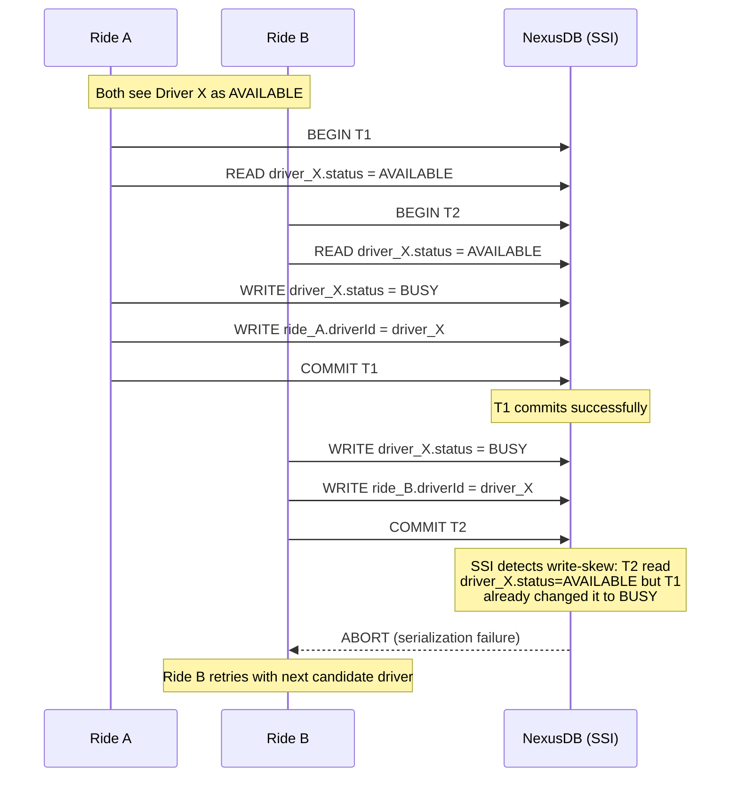

**Solution**: NexusDB's **Serializable Snapshot Isolation (SSI)** detects write-skew anomalies at commit time. Each transaction reads from a consistent snapshot. When T2 tries to commit, SSI checks if any of T2's reads have been invalidated by concurrent writes. Since T1 wrote `driver_X.status = BUSY` after T2 read it as `AVAILABLE`, SSI aborts T2 with a serialization failure. The Ride Service catches this exception and retries matching with the next candidate driver.

**Why not distributed locks?** Distributed locks (e.g., Redlock) require acquiring locks before reads, adding latency (1 RTT to lock service) and introducing deadlock risk when multiple rides try to lock multiple drivers. SSI is **optimistic**: transactions proceed without locks and are validated at commit time. Most transactions succeed on the first attempt because concurrent matching of the exact same driver is rare.

**Cost**: ~1% of transactions are aborted and retried (when two rides genuinely target the same driver simultaneously). This is acceptable because retry latency (< 10ms) is invisible to the rider.

### 7.2 GPS Update Storm (33K writes/sec)

**Problem**: 100,000 online drivers each send GPS updates every 3 seconds, producing 33,333 writes per second. A traditional database cannot absorb this write volume while maintaining query performance.

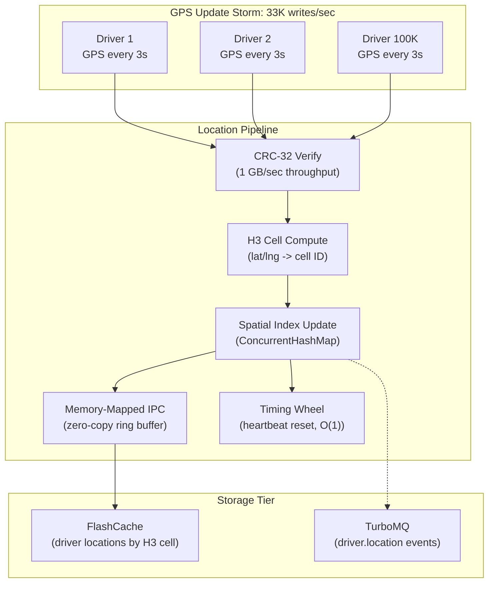

**Solution (multi-layer)**:

1. **CRC-32 checksum** on every GPS packet -- table-driven implementation with IEEE 802.3 polynomial processes at ~1 GB/sec. Drops corrupted packets from unreliable mobile networks before any processing.

2. **Memory-mapped IPC ring buffer** -- `MappedByteBuffer` provides zero-copy data sharing between the GPS ingestion path and the query path. No serialization, no socket overhead, no kernel buffer copies. Write latency: ~10-100 nanoseconds (page cache hit).

3. **Cell-based spatial index** -- `ConcurrentHashMap<Long, CopyOnWriteArrayList<DriverLocation>>` allows lock-free reads (nearest-driver queries) while writers (GPS updates) modify the index concurrently. Driver cell migrations (moving from one H3 cell to another) are atomic remove-from-old + add-to-new operations.

4. **Hierarchical timing wheel** -- O(1) insertion and cancellation for driver heartbeat timers. Each GPS update resets the driver's 30-second inactivity timer. Without the timing wheel (using `PriorityQueue`), 100K heartbeats/sec would cost O(log 100K) = O(17) per operation = 1.7M log operations/sec. The timing wheel reduces this to 100K x O(1) = O(100K).

5. **FlashCache batching** -- Location writes to FlashCache are batched by H3 cell. Instead of 33K individual SET operations, drivers in the same cell are grouped into a single SET per cell per update cycle, reducing FlashCache QPS to ~5K.

6. **TurboMQ location events** -- Published asynchronously (fire-and-forget) after the spatial index is updated. Location events are best-effort; a lost event means a 3-second-old position instead of the current one.

### 7.3 Payment Saga Failure Mid-Way

**Problem**: In the 3-step payment saga (authorize --> capture --> pay_driver), what happens if `capture` succeeds but `pay_driver` fails? Funds have been taken from the rider but not delivered to the driver.

**Solution (Saga pattern with compensating transactions)**:

```
Normal flow:
  authorize_payment  -->  capture_payment  -->  pay_driver
       OK                     OK                  OK
  Result: COMMITTED

Failure at Step 3:
  authorize_payment  -->  capture_payment  -->  pay_driver
       OK                     OK                FAILURE
                                                   |
  Compensate in reverse:                           v
  void_authorization  <--  refund_capture   <-- (abort)
```

**Guarantees**:

| Guarantee | Mechanism |
|-----------|-----------|
| No double-charging | Idempotency keys in FlashCache (TTL-based). Same key returns cached result. |
| No lost payments | Each saga step is a local NexusDB transaction. WAL ensures crash recovery. |
| Automatic cleanup | `SagaOrchestrator.compensateAll()` runs compensations in reverse order. Compensation failures are logged but do not block other compensations. |
| Exactly-once delivery | TurboMQ `payment.saga` topic guarantees ordered delivery per partition. Saga events are published after NexusDB commit. |
| Audit trail | `PaymentLedger` is append-only. Status changes are new records, never mutations. Full history is reconstructible. |

**Idempotency flow**:

```
Request 1: processCharge(idempotencyKey="abc-123")
  -> IdempotencyStore.check("abc-123") = not found
  -> Execute saga, succeed
  -> IdempotencyStore.store("abc-123", result, TTL=24h)
  -> Return SUCCESS

Request 2 (retry): processCharge(idempotencyKey="abc-123")
  -> IdempotencyStore.check("abc-123") = found (cached result)
  -> Return cached SUCCESS without re-executing saga
```

### 7.4 Surge Pricing Staleness

**Problem**: Cached surge multipliers become stale during rapid demand changes. A concert ends and 10,000 riders request rides in 2 minutes, but surge is still showing 1.0x from the previous window.

**Solution (multi-layer freshness)**:

| Layer | Mechanism | Freshness |
|-------|-----------|-----------|
| **Sliding time window** | `SurgeCalculator` accumulates demand/supply in 1-5 minute windows. `reset()` is called at window boundaries to discard stale counts. | 1-5 minutes |
| **Short TTL in FlashCache** | Surge multipliers cached with 30-second TTL. After expiry, next request triggers fresh calculation. | 30 seconds |
| **Event-driven invalidation** | When demand changes by >20% within a window, a `surge.update` event is published to TurboMQ. Subscribers invalidate their local cache immediately. | Near real-time |
| **LSTM forecasting** | AgentForge LSTM agent predicts demand 15 minutes ahead. Forecasted demand is fed into the surge calculator, enabling preemptive surge before actual demand materializes. | 15 minutes ahead |

**Why not real-time per-request surge?** Computing surge for every request (14/sec peak) is feasible, but riders in the same zone at the same time should see the same price. Zone-based caching ensures price consistency and prevents confusion ("Why did my friend get a different price for the same route?").

### 7.5 API Gateway as Single Point of Failure

**Problem**: All client traffic (35K req/sec) flows through the API Gateway. If the gateway crashes, all 50K active rides lose connectivity.

**Solution (stateless horizontal scaling)**:

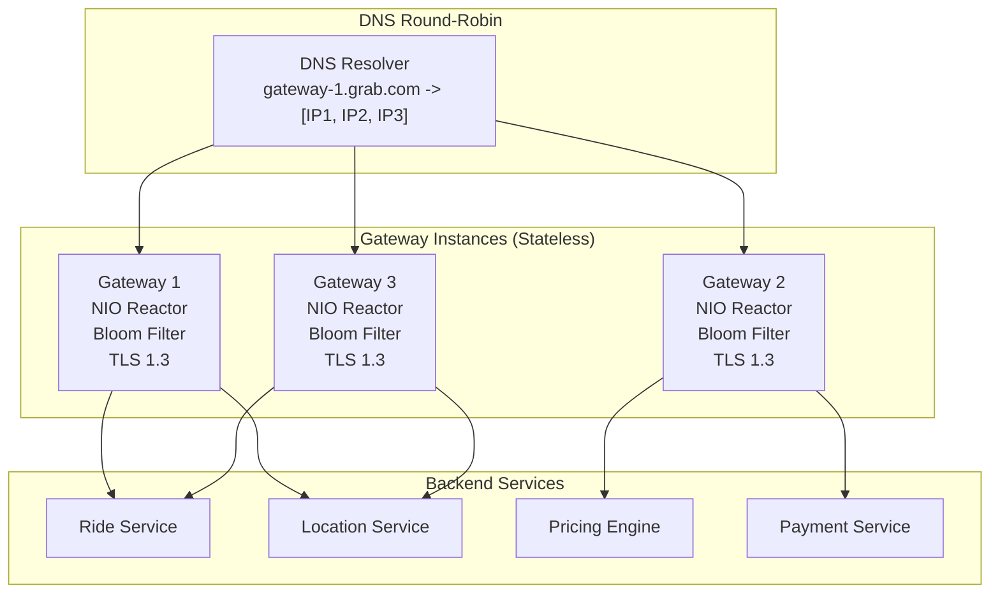

**Why this works**:

| Component | Stateless? | Scaling Strategy |
|-----------|-----------|-----------------|
| **Bloom filter** | Yes -- each instance maintains its own filter from the same config | Independent per instance; false positive rate is per-instance, not global |
| **Token bucket** | Per-instance -- each gateway has its own counters | Effective rate limit is N x per-instance limit. Acceptable for client apps with stable IDs. |
| **TLS sessions** | Per-instance -- session tickets are not shared | TLS 1.3 1-RTT handshake minimizes reconnection cost when a client hits a different gateway |
| **DNS resolution** | Per-instance TTL cache | Each gateway caches DNS results independently; TTL ensures eventual consistency |
| **Request routing** | Stateless -- round-robin across service endpoints | No affinity needed; any gateway can route to any backend |

**TLS 1.3 session resumption**: When a client reconnects to a different gateway instance, TLS 1.3 completes in 1-RTT (vs 2-RTT in TLS 1.2). The ECDHE key exchange in the initial ClientHello includes key material, so the server can start encryption immediately. The cost of hitting a different gateway is one additional RTT, not a full re-handshake.

### 7.6 H3 Cell Boundary Effects

**Problem**: A driver is 50 meters from a rider, but they are in adjacent H3 cells. A naive single-cell query misses the driver entirely.

**Solution**: The k-ring query always searches multiple rings around the rider's cell. For a 5km search radius at resolution 9 (174m edge), k = ceil(5000 / 174) ~ 30, returning ~2,700 cells. Even if the driver is in an adjacent cell, they are included in the k-ring result. The Haversine distance filter then provides exact distance-based filtering.

**Trade-off**: Larger k means more cells to scan, increasing query latency. The relationship is:

| k (rings) | Cells | Approx Radius (m) | Scan Latency |
|-----------|-------|--------------------|-------------|
| 1 | 7 | ~174 | < 1ms |
| 3 | 37 | ~520 | < 5ms |
| 10 | 331 | ~1,740 | < 15ms |
| 30 | 2,731 | ~5,220 | < 50ms |
| 50 | 7,651 | ~8,700 | < 100ms |

GrabFlow defaults to k=30 (5km), providing sub-50ms latency even with 100K drivers.

### 7.7 TurboMQ Event Ordering for Saga Consistency

**Problem**: Payment saga events must be processed in order. If `capture_payment SUCCESS` arrives before `authorize_payment SUCCESS`, the payment state machine transitions incorrectly.

**Solution**: TurboMQ provides **per-partition ordered delivery** via Raft consensus. All events for a single saga are published to the same partition (keyed by `sagaId`). Within a partition, events are appended in the order they were published and consumed in that same order.

```
Partition key: sagaId = "saga-pay-001"

Offset 0: authorize_payment SUCCESS
Offset 1: capture_payment SUCCESS
Offset 2: pay_driver SUCCESS
Offset 3: saga COMMITTED
```

Consumers reading from this partition see events in offset order, guaranteeing correct state machine transitions.

### 7.8 Bottleneck Summary and Mitigation

| Bottleneck | Root Cause | Mitigation | Residual Risk |
|-----------|-----------|-----------|---------------|
| **Double-matching** | Concurrent writes to same driver | NexusDB SSI (abort + retry) | ~1% retry rate under high contention |
| **GPS write storm** | 33K writes/sec from 100K drivers | Memory-mapped IPC + ConcurrentHashMap + FlashCache batching | Ring buffer overflow if reader is > 1 full wrap behind |
| **Saga partial failure** | Network/service failure mid-saga | Compensating transactions in reverse order | Compensation itself can fail (logged, manual intervention) |
| **Surge staleness** | Cached multipliers outdated | 30s TTL + event-driven invalidation + LSTM forecast | LSTM prediction error during unprecedented events |
| **Gateway SPOF** | All traffic through one process | Stateless horizontal scaling + DNS round-robin | DNS TTL propagation delay (~30s) during failover |
| **Cell boundary miss** | Driver in adjacent H3 cell | k-ring expansion (k=30 for 5km) | Increased scan cost at large k values |
| **Event ordering** | Out-of-order saga events | Per-partition Raft ordering in TurboMQ | Partition leader failover adds ~100ms latency |

---

## References

### Academic Papers

- Garcia-Molina, H., & Salem, K. (1987). "Sagas." *Proceedings of the 1987 ACM SIGMOD International Conference on Management of Data*. ACM. -- The foundational paper on saga pattern for distributed transactions.
- Bloom, B. H. (1970). "Space/Time Trade-offs in Hash Coding with Allowable Errors." *Communications of the ACM*, 13(7), 422-426. -- Probabilistic set membership with bounded false positive rate.
- Varghese, G., & Lauck, A. (1997). "Hashed and Hierarchical Timing Wheels." *IEEE/ACM Transactions on Networking*, 5(6), 824-834. -- O(1) timer scheduling used in Linux kernel and Apache Kafka.
- Hochreiter, S., & Schmidhuber, J. (1997). "Long Short-Term Memory." *Neural Computation*, 9(8), 1735-1780. -- Foundation for LSTM surge forecasting.
- Chen, T., & Guestrin, C. (2016). "XGBoost: A Scalable Tree Boosting System." *Proceedings of the 22nd ACM SIGKDD*. ACM. -- Foundation for ETA prediction agent.

### RFCs and Standards

- RFC 8446 -- TLS 1.3 Specification (1-RTT handshake, ECDHE, AEAD ciphers)
- RFC 1035 -- Domain Names: Implementation and Specification (DNS wire protocol)
- RFC 7301 -- TLS Application-Layer Protocol Negotiation (ALPN for HTTP/2)
- IEEE 802.3 -- CRC-32 polynomial `0x04C11DB7` for error detection

### Books

- Kleppmann, M. (2017). *Designing Data-Intensive Applications*. O'Reilly. Chapters 4, 5, 7, 8, 9.
- Aho, A., Lam, M., Sethi, R., & Ullman, J. (2006). *Compilers: Principles, Techniques, and Tools* (2nd ed.). Pearson.
- Nystrom, R. (2021). *Crafting Interpreters*. https://craftinginterpreters.com/
- Chiang, S. (2024). *Hacking the System Design Interview*. -- Seven-step approach used in this document.

### Industry References

- Uber H3: "A Hexagonal Hierarchical Spatial Index" (2018). https://h3geo.org/
- Red Blob Games: "Hexagonal Grids." https://www.redblobgames.com/grids/hexagons/
- LMAX Disruptor: High-Performance Inter-Thread Messaging. https://github.com/LMAX-Exchange/disruptor
- Linux Timing Wheel: `kernel/time/timer.c`. https://git.kernel.org/

### GrabFlow Documentation

- [Architecture](architecture.md) -- Component architecture, threading model, ADRs
- [API Gateway](api-gateway.md) -- Protocol stack, TLS 1.3, DNS, Bloom filter, NIO reactor
- [Location Service](location-service.md) -- H3 hex grid, CRC-32, memory-mapped IPC, timing wheel
- [Ride Matching DSL](ride-matching-dsl.md) -- Lexer, parser, AST, interpreter, state machine
- [Pricing Engine](pricing-engine.md) -- Surge detection, fare estimation, promo codes
- [Payment Orchestration](payment-orchestration.md) -- Saga pattern, idempotency, payment ledger
